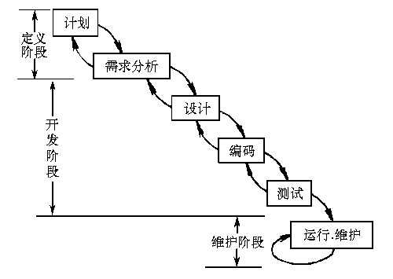
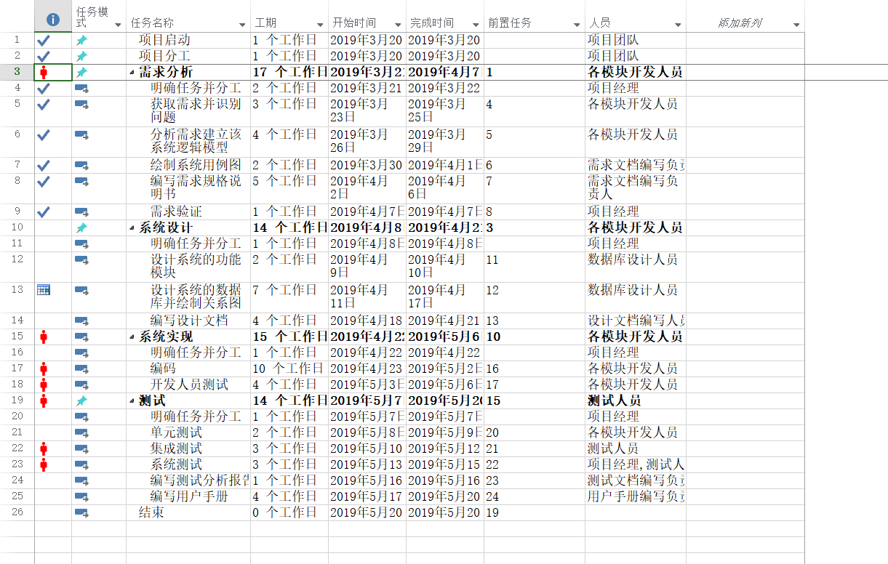
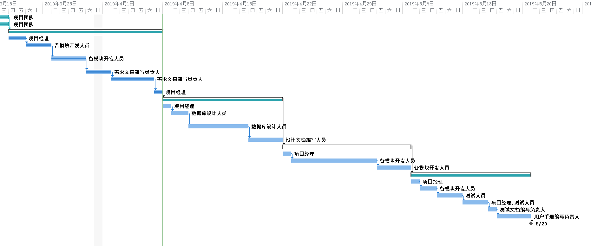

# “小型网上书店系统”软件开发计划书

[TOC]

## 引言（Introduction）

### 背景（Background）

随着互联网时代的到来，相对于实体书店，很多人选择网络购书。某公司计划建立一个网上书店，需要本软件团队来为公司开发一款“小型网上书店系统”。系统的主要功能是实现用户通过互联网的图书购买。未注册的用户（以下称为游客）可以通过本系统搜索图书，并可以查看图书的书名，作者，价格等一系列基本图书信息，还可以通过注册来成为网上书店的会员（注册用户）。会员依然具有游客除了注册之外的所有功能，还可以进行图书的购买操作。购买行为又称作交易，每一次交易对应着一张订单。为了方便，本系统拟提供会员对已下订单的管理功能。

一个典型的会员购买流程如下：

1. 用户（注册并）登录
2. 用户再浏览图书时选择其中一本
3. 填写姓名，收货地址，手机号等必要信息（在这一步生成订单）
4. 用户确认订单，并通过第三方支付平台进行支付
5. 支付成功，通知书店发货
6. 书店发货
7. 用户收货，并确认收货（订单生命周期结束）

考虑到网络交易的非实时性，订单的处理情况可能比较复杂（尤其是涉及到取消订单和退货问题时），在实现时需要注意这一点。

### 目的（Purpose）

编写此软件开发计划书的目的是为了合理安排组织成员，有效利用时间，以确保项目进度，预见项目风险等活动。因此，我们以文件化的形式把对于在项目生命周期内的工作任务范围，各项工作的分工，项目团队的组织结构，各团队成员的工作责任，团队内外沟通协作方式，开发进度，经费预算，项目内外环境条件，风险对策等内容做出的安排以书面的方式，作为项目团队成员以及项目干系人之间的共识和约定，项目生命周期内的所有项目活动的行动基础，和项目团队开展和检查项目工作的依据。以便于项目团队成员更好地了解项目情况，并且便于老师和其他同学了解我们的项目进程安排以及给出宝贵的意见建议。

### 范围（Scope）

“小型网上书店系统”软件开发计划书的主要内容包括:

- 软件规模估计以及相关材料说明
- 软件开发目标设定
- 工作模块设计
- 人力资源计划
- 进度安排计划
- 支持条件以及关键问题
- 项目实施保证

### 参考资料（References）

[1]《GB8567-88 计算机软件产品开发文件编制指南》

[2]吕云翔.软件工程实用教程.北京：清华大学出版社，2015

### 相关文档（Related Documents）

[1]《需求规格说明书》

[2]《软件设计说明书》

### 涉及名词（Related Noun）

[1] 管理员：本系统的后台管理者，可以对图书信息与会员信息进行管理

[2] 游客：没有注册的网站用户，只能浏览图书和查看图书详细信息，注册后可称为会员

[3] 会员：已注册的网站用户，具有游客除了注册之外的所有功能，还可以进行图书的购买操作与订单的管理操作

[4] 第三方支付系统：譬如微信或支付宝这样的第三方支付系统，用来支付相关费用

### 版本更新记录（Version Updated Record）

| 版本号 | 创建者 | 创建日期  | 维护者 | 维护日期  | 维护纪要 |
| :----: | :----: | :-------: | :----: | :-------: | :------: |
|  v1.0  |  李楠  | 2019-3-20 | 刘子明 | 2019-4-20 |          |
|        |        |           |        |           |          |
|        |        |           |        |           |          |
|        |        |           |        |           |          |
|        |        |           |        |           |          |

## 项目概述（Project Summary）

### 项目的目的（Project Purpose）

“小型网上书店系统”的宗旨是为了方便顾客与商家的交易，让顾客不用亲自去书店，在线上也能享受对图书信息的预览与购买图书的服务。该系统主要包括两大部分：用户客户端和管理员客户端。用户客户端完成会员的注册（包括登录名，密码，真实姓名，收货地址，联系方式等信息的填写），登录（登录后会员可查看自己的账户信息，对个人信息的修改，查看订单状态，对书籍和服务进行评价），图书浏览（可以使用搜索或其他方式找到自己喜爱的图书），购买（购买图书），留言（对客服进行留言以及评价图书及服务）等一系列购书功能。管理员客户端完成对图书，会员各种信息的管理（包括数目的增删改，库存信息的管理及会员订单的处理等）。

### 项目的范围（Project Scope）

本节主要依照《需求规格说明书》的相关章节，来说明“小型网上书店系统”的涉及范围

#### 功能模块列表

| 模块编号 | 名称             | 模块功能描述                               |
| :-------: | :---------------: | :-----------------------------------------: |
| 101      | 用户注册         | 用户从游客注册为会员                       |
| 102      | 会员登录         | 已注册用户登录系统                         |
| 103      | 找回密码         | 会员丢失密码后，通过审核重新获取           |
| 104      | 查看个人信息     | 会员查看个人信息                           |
| 105      | 修改个人信息     | 会员登录后对资料进行管理                   |
| 106      | 用户注销         | 会员离开系统时，进行注销                   |
| 107      | 管理会员信息     | 对某些恶意操作的会员账户进行封禁           |
| 201      | 浏览图书         | 会员或游客查看图书简要信息                 |
| 202      | 查看图书详细信息 | 会员或游客查看图书详细信息                 |
| 203 | 查找图书 | 会员或游客检索图书 |
| 301      | 购买图书         | 会员购买图书，并跳转至购物车页面结算       |
| 302      | 添加图书         | 会员添加指定数目的图书至购物车中           |
| 303      | 查看购物车       | 会员查看自己的购物车中未结算商品信息       |
| 304      | 删除图书         | 会员从自己购物车中将所选书籍删除           |
| 305      | 修改图书数量     | 会员选择自己购物车中相关图书的数量作出修改 |
| 306      | 清空购物车       | 会员将自己购物车中的图书信息清空           |
| 401      | 提交订单         | 会员提交购书订单信息给商家                 |
| 402      | 查看所有订单     | 会员查看自己所有的订单记录                 |
| 403      | 查看单个订单     | 会员查看自己的某一订单记录                 |
| 404      | 取消订单         | 会员向系统申请取消此订单                   |
| 405 | 删除订单 | 会员删除已完成的订单 |
| 406     | 评价订单         | 会员对已完成的订单进行评价                 |
| 501      | 查询图书         | 管理员查询相关图书的信息                   |
| 502      | 添加图书         | 管理员添加一本图书的信息                   |
| 503      | 删除图书         | 管理员删除一本图书的信息                   |
| 504      | 修改图书         | 管理员对相关书籍信息进行修改               |
| 505      | 查询会员         | 管理员查询相关会员的信息                   |
| 506      | 查询订单         | 管理员查询相关订单的信息                   |
| 507      | 删除订单         | 管理员删除相关订单的信息                   |
| 601      | 查看书评         | 游客或会员或管理员查看相关书籍的评论       |
| 602      | 发表书评         | 会员在完成订单后对书籍进行评价             |
| 603      | 删除书评         | 管理员对一些不合规定的书评进行删除         |

#### 性能点列表

| 编号 | 性能名称               |      使用部门      |                性能描述                |                输入                |                       系统响应                       |         输出          |
| -- | --------------------- | ---------------- | ------------------------------------ | -------------------------------- | -------------------------------------------------- | ------------------- |
|  1   | 相应的图书查询         | 游客，会员，管理员 |在数据库中查找相应的图书| 图书的相关信息（如书名，ISBN，作者） |                  在2秒中列出所有记录                  |  输出符合要求的记录   |
|  2   | 相应评论的查询         | 游客，会员，管理员 |      在数据库中查找相应书籍的书评      | 图书的相关信息（如书名，ISBN，作者） |                  在2秒中列出所有记录                  |  输出符合要求的记录   |
|  3   | 信息的录入，修改，删除 | 游客，会员，管理员 | 在数据库中录 入、修改、删除 相应的信息 |      录入、修改、删 除的信息       | 在 0.5秒内对数据进行录入、修改和删除并输 出提示信息 |     输出提示信息      |
|  4   | 检查信息的规范性       | 游客，会员，管理员 |  检查录入、修 改、删除的信息 的正确性  |            输入各种信息            |              在 0.1 秒内对信 息进行检查              | 输出信息是否 符合规范 |
|  5   | 报表输出               | 游客，会员，管理员 |   用报表形式显示出数据库中的所有记录   |        输入需要显示的 报表         |          在 5 秒内显示出所有数据库中的记录           |  输出需要显示 的报表  |

### 项目的适用对象（Project Reader）

本平台最终用户是全体想在本平台买书的顾客，本系统操作简单，基本不存在操作难度问题，所需要的硬件设施为可以连接网络有浏览器的计算机。

系统维护人员为项目开发团队，对于此系统的相关部分比较熟悉，团队内部具有对数据库、计算机、网络较为熟悉的人员，维护难度不是很大。

管理员为开发团队指定的人选，需要有一定的图书管理经验与论坛维护经验。

### 需要交付的成果（Necessary Items）

#### 需要交付的软件（Necessary Software）

基于Django设计的"小型网站书店系统"，其中包括后台MySQL数据库系统、可直接在Linux服务器部署的后台逻辑代码（包括使用的用于渲染和与用户交互的前端页面代码）。

#### 需要交付的文档（Necessary Document）

- 《需求规格说明书》
- 《软件开发计划书》
- 《软件设计说明书》
- 《测试报告》
- 《用户使用说明书》
- 《部署文档》

### 项目开发环境（Project Environment）

本网站采用PC机进行开发，开发环境如下：

- 操作系统：Windows10 家庭中文版
- 数据库系统：MySQL-8.0.15
- IDE：JetBrains PyCharm 2018.3.5
- 测试工具：django.test测试工具
- 浏览器：Chrome

## 组织安排（Project Organization）

### 组织结构（Organization Structure）

为了更好地完成本项目，我们成立了由六人组成的项目团队，根据需求分析和开发进度计划，我们的成员分工如下表所示。

| 人员   | 主要任务                                 | 角色                     |
| ------ | ---------------------------------------- | ------------------------ |
| 刘子明 | 安排项目分工，前端部分编码，前期需求分析 | 项目经理、架构师、程序员 |
| 李楠   | 数据库设计，购书、书评等模块后台开发     | 架构师、程序员           |
| 任婷伊 | 前期需求分析，订单模块等后台开发         | 架构师、程序员           |
| 卓毅韬 | 项目测试，管理员功能等后台开发           | 程序员、测试             |
| 徐奕东 | 前端页面设计和编码，项目测试             | 美工、程序员             |
| 郭婉茹 | 界面美化、前端页面设计和编码             | 美工、程序员、测试       |

### 协作与沟通（Cooperation And Communication）

#### 协作沟通对象（Communication Object）

为了很好地完成本项目，需要在团队内部以及外部与教师保持良好的沟通。

在本项目中，需要保持沟通的对象包括项目团队开发人员、软件工程课程助教、软件工程任课教师吕云翔老师等。

#### 沟通方式（Communication Mode）

团队成员直接通过微信等即时聊天工具、会议讨论以及电子邮件进行沟通。会议讨论时时限安排为每周一次，讨论的内容主要包括关于项目做出的新的变动或调整，上一阶段任务完成情况的统计以及总结，下一个阶段任务的详细安排和准备，并作相应的会议记录。

与助教、教师间的沟通主要是通过电子邮件和面对面的交流方式。在项目做出较大的调整、项目进度达到一定程度或者项目出现问题时与教师以及助教联系，汇报项目进展情况，并且及时提交相应的文档和源码，提交任务安排等。

#### 协作模式（Cooperation Mode）

在团队内部，协作模式主要是团队内部协调、沟通为主。针对组员或者项目经理提出的建议或问题，组织团队成员进行开会讨论，并参考教师以及助教的建议，统一意见，做出决定。

## 实施计划（Implementation Plan）

### 风险估计（Risk estimates）

由于团队成员缺乏团队开发经验，对于相关技术的了解不多，因此存在技术风险和进度风险，而且是技术风险导致进度风险的可能性比较大。

进度风险主要是系统实现阶段和测试阶段进度，可能表现为编码工作进展不顺利、各个子系统模块之间的衔接存在问题、数据库系统与网站之间的传输连接稳定性以及测试结果不符合预定要求等问题导致的进度拖后问题。

### 工作流程以及任务分解（Task decomposition）

基于缺乏团队开发的经验，对于相关技术并不熟练，也没有开发过成型的模型的状况，本项目采用瀑布模型进行开发。

整个项目按照技术主要可以分解为Django数据库和表格设计、Django视图函数、Django模板（即前端部分），按照功能模块设计，整个项目可以分解为下面的部分。

| 任务     | 主要内容                                     | 负责人 |
| -------- | -------------------------------------------- | ------ |
| 登录模块 | 会员和管理员注册、登录、修改账户信息等       | 刘子明 |
| 购书模块 | 用户查找、浏览、购买图书，添加、删除购物车等 | 李楠   |
| 订单模块 | 生成、提交、查看、取消订单等                 | 任婷伊 |
| 管理模块 | 管理员对图书信息进行增删改查等               | 卓毅韬 |
| 书评模块 | 查看、发表、浏览、删除书评等                 | 李楠   |
| 页面美化 | 网站页面和交互功能的美化完善                 | 郭婉茹 |
| 测试模块 | 系统集成测试                                 | 徐奕东 |

### 进度安排（Schedule）

项目进度安排使用Microsoft Project 2016设计。

#### 项目进度日程安排

#### 项目进度安排甘特图

### 项目控制计划（Project Control Plan）

项目控制依据技术风险和进度风险而制定。

#### 技术风险控制（Technology Risk Control）

针对团队成员对于网站架设技术不熟悉的情况，采用以下计划控制技术风险：

- 在项目开展前期进行积极有效的技术学习。在项目启动前期，我们将会安排一周的时间进行集中式的技术学习，学习到网站架设方面的基本内容。同时，在项目实际开展过程中，在完成相应任务的同时，继续学习需要的技术。

- 与教师、助教保持良好、及时的沟通。在技术方面出现问题时，及时与老师助教进行沟通，听取建议，尽量少走弯路，规避可能存在的技术风险。

#### 进度风险控制（Schedule Risk Control）

为了确保团队能够按照项目计划，及时完成相应的任务，我们采取了以下的措施规避进度风险。

- 项目经理和团队成员之间做好相应的监督工作。团队中，项目经理和组员之间相互监督，相互督促可以有效地减少进度风险。

- 保持每周一次的例会。在会议上通过总结上一阶段的任务和安排下一阶段的任务，保持整个项目的进度。

- 与教师保持良好的沟通，及时向教师提交任务安排，通过教师的监督来确保进度的保持。

## 支持条件（Support Conditions）

### 计算机系统支持（Computer Systems Support）

#### 开发时需要的支持条件

前期使用个人PC充当本地的服务器功能，服务器数量：2台（一台充当备份）。

PC工作站的具体配置要求：

- 处理器： Intel(R) Core(TM) i7-8750H CPU @ 2.20GHz 2.21GHz
- 内存（RAM）：8.0GB
- 硬盘容量：500GB
- 输入输出设备：打印机等
- 网络设备：WLAN(Intel(R) Wireless-AC 9462); 以太网

后期需要租用云端的服务器，所需服务器的配置：

- CPU：Intel Xeon E5-2680 2.50GHz 以上
- 内存：1GB以上
- 硬盘：40GB以上  

软件开发环境配置：

- 操作系统：Windows 10
- 集成开发工具：JetBrains PyCharm 2018.3.5、Visual Studio Code
- 数据库：MySQL-8.0.15
- 其他开发工具：Visual Studio Code等

#### 运行时需要的支持条件

##### 服务器硬件要求

1. 服务器的中央处理部件（CPU）建议使用Xeon E5-2680或配置更好的处理器芯片；
2. 服务器内存：服务器专用内存ECC内存；
3. 硬盘：磁盘冗余阵列（RAID 01），保证数据存储的绝对可靠；
4. 使用两台服务器（一台用作备份）：防止服务器发生不可预测的故障，或服务器的定期维护对业务造成的影响；
5. 服务器应支持热插拔电源；
6. 服务器必须配备UPS（不间断电源）；
7. 选择云端服务器，以便进行程序调试；
8. 服务器需要固定的IP地址；
9. 其他性能在经济条件允许的情况下，尽量使用告诉稳定的配件。

##### 服务器软件要求

1. 操作系统：Linux（Kernel 4.0以上）（具体版本未定）；
2. 数据库：MySQL-8.0.15；
3. 服务器必须使用专业的防火墙和反病毒软件；
4. 除了为了运行必须配备的程序意外，服务器上建议尽量不要安装其他无关程序，以减少程序的混乱或者程序的意外冲突。

### 用户支持（User Support）

本平台面向的用户是全体中国公民，其能够熟练的使用网络和网络中的软件进行操作，并且我们的平台力求在操作上简洁实用，而用户所需要的硬件设施仅仅为可以上网的计算机或平板电脑以及智能手机等。

向本小组成员进行培训，其内容包括图书库的工作结构、管理系统的工作流程，以及图书仓库的规模容量。配备相应的硬件系统，做到规范操作，备份好数据防止数据丢失。

### 需要的外界支持（Outside Support）

本系统为独立开发，不需要外单位提供条件。

## 基本预算（Basic budget）

### 人员成本（Personnel costs）

由于本项目并不是正式的进行商业运行的项目，而是既作为首次团队开发项目的实战，又是作为完成软件工程作业项目需要，所以人员的费用方面不需要考虑，本项目的团队设立项目经理1名，需求分析、设计编码3名，测试、美工人员2名。直接人力成本6人。

### 设备成本（Equipment costs）

在前期的网站设计过程中，设备成本主要来自组员的个人PC。数据库的设计与运行测试，代码的编写，文档的撰写，美化工作的完成，均在个人的PC机上完成。

后期在网站正式投入运营后，设备成本主要来自租用服务器的费用。

### 其他经费预算（Other costs）

在可能进行经费支出的方面，我们都节约成本，例如：在项目初期学习的过程中，学习资料和电子文献的获取，我们充分利用了学校图书馆的丰富资源，并得到了老师的许多节约成本的指点，使得项目的成本接近于无。

## 8 专题计划要点（Thematic elements of the plan） 

### 8.1 项目成员培训计划（Members’ training Plan）

### 8.2 项目测试计划（Project Test Plan）

2019年5月7日——2019年5月20日对小型网上书店项目进行各项功能的测试工作

### 8.3 质量保证计划（Quality Assurance Plan）

通过Github将功能合并至主线(master分支时)，至少需要两人对合并提交进行代码评审

### 8.4 安全保密计划（Security Plan）

在从项目开发阶段到最后软件的正式发布期间，通过Git版本管理系统对项目进行版本管理，通过Github项目托管网站对代码进行网上托管