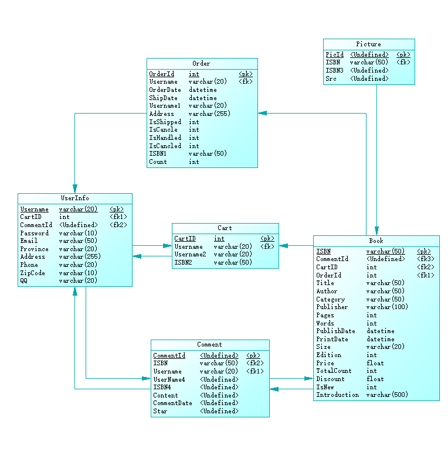

# 1. 引言

## 1.1 编写目的

在完成小型网上书店系统需求分析的基础上，我们依据《需求规格说明书》对该系统进行了设计。为了文档化对该系统的设计，编写了本文档。

## 1.2 命名规范

数据库表明、字段名用大写开头的英文命名。

私有变量用“_”开头的小写英文命名，其他变量用大写英文字母开头。

所有的函数用大写英文字母开头。

## 1.3 术语定义

总体结构：软件系统的总体逻辑结构，本系统采用面向对象的方法对系统进行设计。

概念数据模型(CDM):关系数据库的概念设计模型，主要表现为E-R图。

物理数据模型(PDM):关系数据库的物理设计模型。

## 1.4 参考资料

[1]吕云翔.软件工程实用教程.北京:清华大学出版社,2015.

## 1.5 相关文档

《需求规格说明书》

## 1.6 版本更新信息

| 版本号 | 创建者 | 创建日期  | 维护者 | 维护日期  | 维护纪要 |
| :----: | :----: | :-------: | :----: | :-------: | :------: |
|  v1.0  |  李楠  | 2019-3-20 | 刘子明 | 2019-4-20 |          |
|  v1.1  | 刘子明 | 2019-4-21 |  李楠  | 2019-5-15 |          |
|        |        |           |        |           |          |
|        |        |           |        |           |          |
|        |        |           |        |           |          |

# 2. 总体设计

## 2.1 硬件运行环境

1. 服务器

   CPU：Intel Xeon E5-2680 2.50GHz 以上
   内存：1GB及以上
   网络配置：100M网卡及以上

2. Web浏览PC

   CPU：AMD或Inter 1.6GHz以上
   内存：1GB及以上
   网络配置：100M网卡及以上

## 2.2 软件运行环境

1. 服务器

   操作系统：Linux（Kernel 4.0以上）

   数据库：MySQL-8.0.15

   Web服务器：

2. 客户机

   操作系统无限制，有网络，浏览器即可

## 2.3 子系统清单

#### 子系统清单图如下
| 子系统编号 |    子系统名称    |                      子系统功能描述                       |
| :--------: | :--------------: | :-------------------------------------------------------: |
|     1      | 个人信息管理系统 | 注册登录功能的实现，个人信息维护更新 ，管理员管理网页用户 |
|     2      |   图书浏览系统   |                  用户查询、浏览书籍信息                   |
|     3      |   会员购书系统   |               会员购买图书，添加删除购物车                |
|     4      |   订单管理系统   |                       用户提交订单                        |
|     5      |   图书管理系统   |                  添加图书、维护图书信息                   |
|     6      |   书评管理系统   |             添加书评、对书进行评论，维护书评              |

## 2.4 功能模块清单

#### 功能模块图如下

| 模块编号 |       名称       |                         模块功能描述                         |
| :------: | :--------------: | :----------------------------------------------------------: |
|   101    |     注册账号     |                     用户从游客注册为会员                     |
|   102    |     登录系统     |                      已注册用户登录系统                      |
|   103    |     找回密码     |               会员丢失密码后，通过审核重新获取               |
|   104    |   查看个人信息   |                       会员查看个人信息                       |
|   105    |   修改个人信息   |                   会员登录后对资料进行管理                   |
|   106    |     用户注销     |                   会员离开系统时，进行注销                   |
|   107    |   管理会员信息   |               对某些恶意操作的会员账户进行封禁               |
|   201    |   浏览图书目录   |                    会员或游客浏览图书目录                    |
|   202    | 查看图书详细信息 |                  会员或游客查看图书详细信息                  |
|   203    |     查找图书     |                      会员或游客检索图书                      |
|   204    |   浏览畅销榜单   |                   向会员和游客推荐热卖图书                   |
|   301    |     购买图书     |             会员购买图书，并跳转至购物车页面结算             |
|   302    |     添加图书     |               会员添加指定数目的图书至购物车中               |
|   303    |    查看购物车    |             会员查看自己的购物车中未结算商品信息             |
|   304    |     删除图书     |               会员从自己购物车中将所选书籍删除               |
|   305    |   修改图书数量   |          会员选择自己购物车中相关图书的数量作出修改          |
|   306    |    清空购物车    |               会员将自己购物车中的图书信息清空               |
|   401    |     提交订单     |          会员提交购书订单信息（含收货人信息）给商家          |
|   402    |   查看所有订单   |                  会员查看自己所有的订单记录                  |
|   403    |   查看单个订单   |                  会员查看自己的某一订单记录                  |
|   404    |     取消订单     |                   会员向系统申请取消此订单                   |
|   405    |     评价订单     |                  会员对已完成的订单进行评价                  |
|   406    |  确认订单并付款  |            会员提交订单后，检查确认订单信息并付款            |
|   407    |     确认收货     |                  会员确认收货，此笔交易完成                  |
|   408    |     申请售后     |                      会员申请退货或换货                      |
|   501    |     查询图书     |                   管理员查询相关图书的信息                   |
|   502    |     添加图书     |                   管理员添加一本图书的信息                   |
|   503    |     删除图书     |                   管理员删除一本图书的信息                   |
|   504    |     修改图书     |                 管理员对相关书籍信息进行修改                 |
|   505    |     查询会员     |                   管理员查询相关会员的信息                   |
|   506    |     查询订单     |                   管理员查询相关订单的信息                   |
|   507    |     删除订单     |                   管理员删除相关订单的信息                   |
|   508    |     更新订单     |             管理员更新发货、退货、换货等订单状态             |
|   601    |     查看书评     |             游客或会员或管理员查看相关书籍的评论             |
|   602    |     发表书评     |                会员在完成订单后对书籍进行评价                |
|   603    |     删除书评     | 管理员对一些不合规定的书评进行删除，会员可以删除自己写的书评 |

# 3. 数据库设计

## 3.1 数据库中表名列表

<table>
<tr>
<td>表名</td>
<td>用途</td>
</tr>
<tr>
<td>Book</td>
<td>图书信息表</td>
</tr>
<tr>
<td>Cart</td>
<td>购物车内物品表</td>
</tr>
<tr>
<td>Comment</td>
<td>书籍评论表</td>
</tr>
<tr>
<td>Order</td>
<td>订单表</td>
</tr>
<tr>
<td>Picture</td>
<td>书籍图片的表</td>
</tr>
<tr>
<td>UserInfo</td>
<td>会员信息表</td>
</tr>
</table>


## 3.2 数据库中的表关系(任婷伊画图)




## 3.3 数据库表的详细清单

| 序号 | 英文字段名 | 中文字段名 |   数据类型   | 是否允许为空 | 主键/外键 |
| :--: | :--------: | :--------: | :----------: | :----------: | :-------: |
|  1   |  UserName  | 会员用户名 | varchar(20)  |      否      |   主键    |
|  2   |  Password  |    密码    | varchar(10)  |      否      |           |
|  3   |   Email    |    邮箱    | varchar(50)  |      否      |           |
|  4   |  Province  |    省份    | varchar(20)  |      是      |           |
|  5   |  Address   |    地址    | varchar(255) |      是      |           |
|  6   |   Phone    |    电话    | varchar(20)  |      是      |           |
|  7   |  ZipCode   |    邮编    | varchar(10)  |      是      |           |
|  8   |     QQ     |   QQ号码   | varchar(20)  |      是      |           |

| 序号 |  英文字段名  | 中文字段名 |   数据类型   | 是否允许为空 | 主键/外键 |
| :--: | :----------: | :--------: | :----------: | :----------: | :-------: |
|  1   |     ISBN     |    书号    | varchar(50)  |      否      |   主键    |
|  2   |    Title     |    书名    | varchar(50)  |      否      |           |
|  3   |    Author    |    坐着    | varchar(50)  |      否      |           |
|  4   |   Category   |    类别    | varchar(50)  |      否      |           |
|  5   |  Publisher   |   出版社   | varchar(100) |      否      |           |
|  6   |    Pages     |    页数    |     int      |      是      |           |
|  7   |    Words     |    字数    |     int      |      是      |           |
|  8   | PublishDate  |  出版日期  |   datetime   |      是      |           |
|  9   |  PrintDate   |  印刷日期  |   datetime   |      是      |           |
|  10  |     Size     |    开本    | varchar(20)  |      是      |           |
|  11  |   Edition    |    版次    |     int      |      是      |           |
|  12  |    Price     |    价格    |    float     |      否      |           |
|  13  |  TotalCount  |    库存    |     int      |      否      |           |
|  14  |   Discount   |    折扣    |    float     |      是      |           |
|  15  |    IsNew     | 是否是新品 |     int      |      是      |           |
|  16  | Introduction |    介绍    | varchar(500) |      否      |           |


| 序号 | 英文字段名 |           中文字段名           |   数据类型   | 是否允许为空 | 主键/外键 |
| :--: | :--------: | :----------------------------: | :----------: | :----------: | :-------: |
|  1   |  OrderId   |             订单号             |     int      |      否      |   主键    |
|  2   | OrderDate  |            下单日期            |   datetime   |      否      |           |
|  3   |  ShipDate  |            发货日期            |   datetime   |      否      |           |
|  4   |  UserName  |           会员用户名           | varchar(20)  |      否      |   外键    |
|  5   |  Address   |            送货地址            | varchar(255) |      否      |           |
|  6   | IsShipped  |          订单是否送出          |     int      |      否      |           |
|  7   |  IsCancle  |      用户是否申请取消订单      |     int      |      否      |           |
|  8   | IsHandled  | 管理员是否处理了取消订单的申请 |     int      |      否      |           |
|  9   | IsCancled  |       订单是否被成功取消       |     int      |      否      |           |
|  10  |    ISBN    |              书号              | varchar(50)  |      否      |   外键    |
|  11  |   Count    |           订书的数目           |     int      |      否      |           |

| 序号 | 英文字段名 |   中文字段名   |  数据类型   | 是否允许为空 | 主键/外键 |
| :--: | :--------: | :------------: | :---------: | :----------: | :-------: |
|  1   |   CartID   | 购物车信息编号 |     int     |      否      |   主键    |
|  2   |  UserName  |   会员用户名   | varchar(20) |      否      |   外键    |
|  3   |    ISBN    |      书号      | varchar(50) |      否      |   外键    |

| 序号 | 英文字段名 |  中文字段名  |   数据类型   | 是否允许为空 | 主键/外键 |
| :--: | :--------: | :----------: | :----------: | :----------: | :-------: |
|  1   |   PicId    | 书籍图片编号 |     int      |      否      |   主键    |
|  2   |    ISBN    |     书号     | varchar(50)  |      否      |   外键    |
|  3   |    Src     |   图片路径   | varchar(255) |      否      |           |

| 序号 | 英文字段名  | 中文字段名 |   数据类型   | 是否允许为空 | 主键/外键 |
| :--: | :---------: | :--------: | :----------: | :----------: | :-------: |
|  1   |  CommentId  |   评论号   |     int      |      否      |   主键    |
|  2   |  UserName   | 会员用户名 | varchar(20)  |      否      |   外键    |
|  3   |    ISBN     |    书号    | varchar(50)  |      否      |   外键    |
|  4   |   Content   |  评论内容  | varchar(300) |      否      |           |
|  5   | CommentDate |  评论时间  |   datetime   |      否      |           |
|  6   |    Star     |  评论星级  |     int      |      否      |           |


# 4. 典型的子系统设计(郭婉茹完成)

调一个你觉得好写的子系统仿照我发在群里的文档写即可

# 5. 功能模块设计(李楠)

可以借鉴群里的文档和翔哥的课本，应该大多数都有

## 1. 主页：Index.html

参数：无

调用背景：

1. 登录验证通过以后，会跳转至次页面
2. 作为本系统访问的入口，第一次访问会跳转至此页面
3. 点击左上角的网站logo或者导航条上的主页超链接会跳转至此页面
4. 点击页面顶部的导航条可以跳转到相应的页面去
5. 点击页面底部的店铺信息与关于我们块跳转到相应的页面信息
6. 点击中间推荐的商品列表中的某一商品可以跳转到该商品的详细介绍页面

页面组成：由一个顶部导航条，一个轮播图，一些推荐的商品列表以及底部的店铺信息与关于我们块组成

调用描述：无

## 2.登陆页面：Login.html

参数：type=？,指定登录之后跳转的页面。如果在点击登录后的判定用户选择的是注册用户，则跳转到index.html并将相关用户信息写入session；否则，如果用户选择的是管理员，则跳转到Administer.html页面，并将相关信息写入session

调用背景：

页面组成：

## 3.注册页面： Register.html


# 6. 储存过程设计(任婷伊，卓毅韬)

有六张表，任婷伊1 3 5，卓毅韬2 4 6

1.CollectBook()

功能描述：选择图书

入口参数：@UserID(varchar(20),无默认值)、@BookID(smallint,无默认值)

出口参数：无

伪语言实现：

```SQL
create procedure CollectBook(@UseID varchar(20), @BookID smallint)
as
declare
@BookWarehouseID smallint
@QuanZilD smallint
if @UserID is not null
    begin
    insert into User values(@BookWarehouseID,@UserID,@QunZilD,@BookID,'Collect')
    where @BookWarehouseID=select BookWarehouseID from BookWarehouse
    end
return
```

3.DeleteBook()

功能描述：删除图书

入口参数：@BookID(smallint,无默认值)

出口参数：无

伪语言实现：

```SQL
create procedure DeleteBook(@BookID smallint)
as
if @BookID is not null
    begin
    delete from BookWarehouseID
    where @BookID=BookWarehouseID.BookID
    end
return
```

5.DeleteForum()

功能描述：删除讨论

入口参数：@ForumID(smallint,无默认值)

出口参数：无

伪语言实现：

```SQL
create procedure DeleteForum(@ForumID smallint)
as
if @ForumID is not null
    begin
    delete from Forum
    where @ForumID=Forum.ForumID
    end
return
```

# 7. 接口设计(任婷伊)
## 7.1 用户接口
用ASP.NET4.5搭建，提供清晰简洁易用美观的用户界面
## 7.2 外部接口
数据存储：本系统设计大量数据的存储及处理，通过ADO.NET与SQL Server2012 进行交互。
## 7.3 内部接口
本系统以数据为中心，网站模块均通过ADO.NET与数据库服务器进行交互
# 8. 角色授权设计(徐奕东)

|    子系统名称    | 管理员 | 会员 | 游客 |
| :--------------: | :----: | :--: | :--: |
| 个人信息管理系统 |   ●    |  ●   |  ○   |
|   图书浏览系统   |        |  ●   |  ●   |
|   会员购书系统   |        |  ●   |      |
|   订单管理系统   |        |  ●   |      |
|   图书管理系统   |   ●    |      |      |
|   书评管理系统   |   ●    |  ●   |  ○   |
 ●表示有全部权限，○表示享有权限但并非全部权限。

# 9. 系统错误处理(徐奕东)

## 9.1出错信息
1.  对游客、会员输入的各项内容进行有效性、安全性检查，减少错误发生的几率；
2.  对程序运行中的异常均进行捕获，按统一的方式将出错提示信息提供给游客和会员；
3.  当游客、会员访问自身权限以外的信息时，将其导航到统一的出错提示页面。

## 9.2 故障预防与补救 
 以统一的机制进行网站权限的控制，对程序中用到的数据尽量进行加密，以减少黑客攻击的危害。定期对数据库中的数据进行海量备份及增量备份。

## 9.3 系统维护设计

1.  编码实现时应采用模块化和分层的思想，提高模块内部的内聚，减少模块间的耦 合。使系统逻辑结构清晰,从而增强可读性和可维护性。  
2.  面向数据与面向对象相结合，模块划分符合面向对象思想。  
3.  在编码过程中注意标识符命名的意义，添加适量注释。 

# 10. 测试计划(徐奕东)

测试计划作为本系统的测试指导，测试成员按计划和规定进行测试。本系统的测试将从 单元测试、集成测试、系统测试 3 个方面来设计。 

