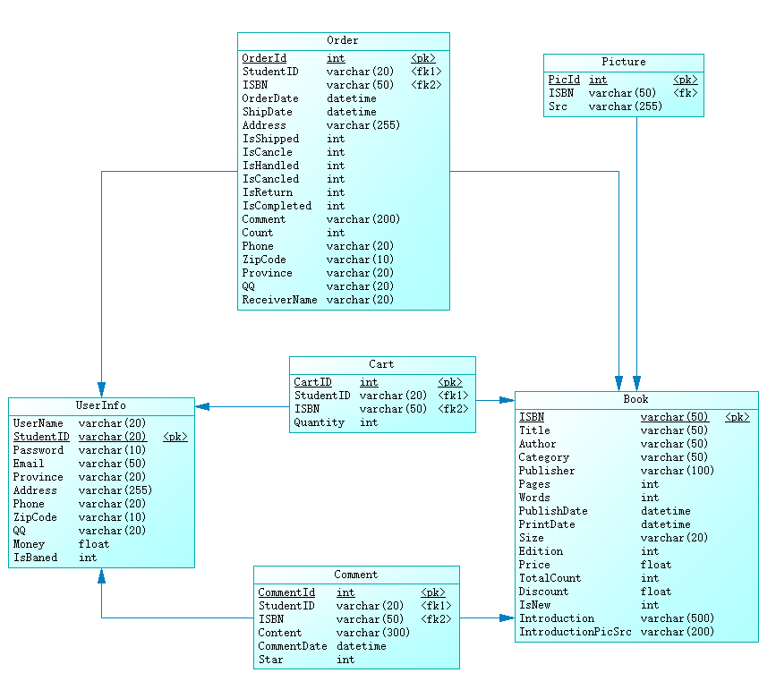

[TOC]

# “小型网上书店系统”软件设计说明书

## 1. 引言

### 1.1 编写目的

在完成小型网上书店系统需求分析的基础上，我们依据《需求规格说明书》对该系统进行了设计。为了文档化对该系统的设计，编写了本文档。

### 1.2 命名规范

数据库表明、字段名用大写开头的英文命名。

私有变量用“_”开头的小写英文命名，其他变量用大写英文字母开头。

所有的函数用大写英文字母开头。

### 1.3 术语定义

总体结构：软件系统的总体逻辑结构，本系统采用面向对象的方法对系统进行设计。

概念数据模型(CDM):关系数据库的概念设计模型，主要表现为E-R图。

物理数据模型(PDM):关系数据库的物理设计模型。

### 1.4 参考资料

[1]吕云翔.软件工程实用教程.北京:清华大学出版社,2015.

### 1.5 相关文档

《需求规格说明书》

### 1.6 版本更新信息

| 版本号 | 创建者 | 创建日期  | 维护者 | 维护日期  | 维护纪要 |
| :----: | :----: | :-------: | :----: | :-------: | :------: |
|  v1.0  |  李楠  | 2019-3-20 | 刘子明 | 2019-4-20 |          |
|  v1.1  | 刘子明 | 2019-4-21 |  李楠  | 2019-5-15 |          |
|        |        |           |        |           |          |
|        |        |           |        |           |          |
|        |        |           |        |           |          |

## 2. 总体设计

### 2.1 硬件运行环境

1. 服务器

   CPU：Intel Xeon E5-2680 2.50GHz 以上
   内存：1GB及以上
   网络配置：100M网卡及以上

2. Web浏览PC

   CPU：AMD或Inter 1.6GHz以上
   内存：1GB及以上
   网络配置：100M网卡及以上

### 2.2 软件运行环境

1. 服务器

   操作系统：Linux（Kernel 4.0以上）

   数据库：MySQL-8.0.15

   Web服务器：nginx、uWSGI

2. 客户机

   操作系统无限制，有网络，浏览器即可

### 2.3 子系统清单

#### 子系统清单图如下

| 子系统编号 |    子系统名称    |                      子系统功能描述                       |
| :--------: | :--------------: | :-------------------------------------------------------: |
|     1      | 个人信息管理系统 | 注册登录功能的实现，个人信息维护更新 ，管理员管理网页用户 |
|     2      |   图书浏览系统   |                  用户查询、浏览书籍信息                   |
|     3      |   会员购书系统   |               会员购买图书，添加删除购物车                |
|     4      |   订单管理系统   |                       用户提交订单                        |
|     5      |   图书管理系统   |                  添加图书、维护图书信息                   |
|     6      |   书评管理系统   |             添加书评、对书进行评论，维护书评              |

### 2.4 功能模块清单

#### 功能模块图如下

| 模块编号 |       名称       |                         模块功能描述                         |
| :------: | :--------------: | :----------------------------------------------------------: |
|   101    |     注册账号     |                     用户从游客注册为会员                     |
|   102    |     登录系统     |                      已注册用户登录系统                      |
|   103    |     找回密码     |               会员丢失密码后，通过审核重新获取               |
|   104    |   查看个人信息   |                       会员查看个人信息                       |
|   105    |   修改个人信息   |                   会员登录后对资料进行管理                   |
|   106    |     用户注销     |                   会员离开系统时，进行注销                   |
|   107    |   管理会员信息   |               对某些恶意操作的会员账户进行封禁               |
|   201    |   浏览图书目录   |                    会员或游客浏览图书目录                    |
|   202    | 查看图书详细信息 |                  会员或游客查看图书详细信息                  |
|   203    |     查找图书     |                      会员或游客检索图书                      |
|   204    |   浏览畅销榜单   |                   向会员和游客推荐热卖图书                   |
|   301    |     购买图书     |             会员购买图书，并跳转至购物车页面结算             |
|   302    |     添加图书     |               会员添加指定数目的图书至购物车中               |
|   303    |    查看购物车    |             会员查看自己的购物车中未结算商品信息             |
|   304    |     删除图书     |               会员从自己购物车中将所选书籍删除               |
|   305    |   修改图书数量   |          会员选择自己购物车中相关图书的数量作出修改          |
|   306    |    清空购物车    |               会员将自己购物车中的图书信息清空               |
|   401    |     提交订单     |          会员提交购书订单信息（含收货人信息）给商家          |
|   402    |   查看所有订单   |                  会员查看自己所有的订单记录                  |
|   403    |   查看单个订单   |                  会员查看自己的某一订单记录                  |
|   404    |     取消订单     |                   会员向系统申请取消此订单                   |
|   405    |     评价订单     |                  会员对已完成的订单进行评价                  |
|   406    |  确认订单并付款  |            会员提交订单后，检查确认订单信息并付款            |
|   407    |     确认收货     |                  会员确认收货，此笔交易完成                  |
|   408    |     申请售后     |                      会员申请退货或换货                      |
|   501    |     查询图书     |                   管理员查询相关图书的信息                   |
|   502    |     添加图书     |                   管理员添加一本图书的信息                   |
|   503    |     删除图书     |                   管理员删除一本图书的信息                   |
|   504    |     修改图书     |                 管理员对相关书籍信息进行修改                 |
|   505    |     查询会员     |                   管理员查询相关会员的信息                   |
|   506    |     查询订单     |                   管理员查询相关订单的信息                   |
|   507    |     删除订单     |                   管理员删除相关订单的信息                   |
|   508    |     更新订单     |             管理员更新发货、退货、换货等订单状态             |
|   601    |     查看书评     |             游客或会员或管理员查看相关书籍的评论             |
|   602    |     发表书评     |                会员在完成订单后对书籍进行评价                |
|   603    |     删除书评     | 管理员对一些不合规定的书评进行删除，会员可以删除自己写的书评 |

## 3. 数据库设计

### 3.1 数据库中表名列表

<table>
<tr>
<td>表名</td>
<td>用途</td>
</tr>
<tr>
<td>Book</td>
<td>图书信息表</td>
</tr>
<tr>
<td>Cart</td>
<td>购物车内物品表</td>
</tr>
<tr>
<td>Comment</td>
<td>书籍评论表</td>
</tr>
<tr>
<td>Order</td>
<td>订单表</td>
</tr>
<tr>
<td>Picture</td>
<td>书籍图片的表</td>
</tr>
<tr>
<td>UserInfo</td>
<td>会员信息表</td>
</tr>
</table>

### 3.2 数据库中的表关系



### 3.3 数据库表的详细清单

#### 3.3.1 会员信息表

| 序号 | 英文字段名 | 中文字段名 |   数据类型   | 是否允许为空 | 主键/外键 |
| :--: | :--------: | :--------: | :----------: | :----------: | :-------: |
|  1   | StudentID  |  会员学号  | varchar(20)  |      否      |   主键    |
|  2   |  UserName  | 会员用户名 | varchar(25)  |      否      |           |
|  3   |  Password  |    密码    | varchar(10)  |      否      |           |
|  4   |   Email    |    邮箱    | varchar(50)  |      否      |           |
|  5   |  Province  |    省份    | varchar(20)  |      是      |           |
|  6   |  Address   |    地址    | varchar(255) |      是      |           |
|  7   |   Phone    |    电话    | varchar(20)  |      是      |           |
|  8   |  ZipCode   |    邮编    | varchar(10)  |      是      |           |
|  9   |     QQ     |   QQ号码   | varchar(20)  |      是      |           |
|  10  |   Money    |  账户余额  |    float     |      否      |           |
|  11  |  IsBaned   | 是否被封禁 |     int      |      否      |           |

#### 3.3.2 图书信息表

| 序号 |     英文字段名     |      中文字段名      |   数据类型   | 是否允许为空 | 主键/外键 |
| :--: | :----------------: | :------------------: | :----------: | :----------: | :-------: |
|  1   |        ISBN        |         书号         | varchar(50)  |      否      |   主键    |
|  2   |       Title        |         书名         | varchar(50)  |      否      |           |
|  3   |       Author       |         坐着         | varchar(50)  |      否      |           |
|  4   |      Category      |         类别         | varchar(50)  |      否      |           |
|  5   |     Publisher      |        出版社        | varchar(100) |      否      |           |
|  6   |       Pages        |         页数         |     int      |      是      |           |
|  7   |       Words        |         字数         |     int      |      是      |           |
|  8   |    PublishDate     |       出版日期       |   datetime   |      是      |           |
|  9   |     PrintDate      |       印刷日期       |   datetime   |      是      |           |
|  10  |        Size        |         开本         | varchar(20)  |      是      |           |
|  11  |      Edition       |         版次         |     int      |      是      |           |
|  12  |       Price        |         价格         |    float     |      否      |           |
|  13  |     TotalCount     |         库存         |     int      |      否      |           |
|  14  |      Discount      |         折扣         |    float     |      是      |           |
|  15  |       IsNew        |      是否是新品      |     int      |      是      |           |
|  16  |    Introduction    |         介绍         | varchar(500) |      否      |           |
|  17  | IntroductionPicSrc | 介绍商品的长图的路径 | varchar(200) |      否      |           |

#### 3.3.3 订单表

| 序号 |  英文字段名  |      中文字段名      |   数据类型   | 是否允许为空 | 主键/外键 |
| :--: | :----------: | :------------------: | :----------: | :----------: | :-------: |
|  1   |   OrderId    |        订单号        |     int      |      否      |   主键    |
|  2   |  OrderDate   |       下单日期       |   datetime   |      否      |           |
|  3   |   ShipDate   |       发货日期       |   datetime   |      否      |           |
|  4   |  StudentID   |     下单会员学号     | varchar(20)  |      否      |   外键    |
|  5   |   Address    |       送货地址       | varchar(255) |      否      |           |
|  6   |  IsShipped   |     订单是否送出     |     int      |      否      |           |
|  7   |   IsCancle   | 用户是否已经取消订单 |     int      |      否      |           |
|  8   |  IsHandled   |   用户是否确认订单   |     int      |      否      |           |
|  9   |  IsCancled   |   订单是否退款完成   |     int      |      否      |           |
|  10  |   IsReturn   |   用户是否要求退款   |     int      |      否      |           |
|  11  | IsCompleted  |     订单是否完成     |     int      |      否      |           |
|  12  |   Comment    |     对订单的评价     | varchar(500) |      是      |           |
|  13  |     ISBN     |         书号         | varchar(50)  |      否      |   外键    |
|  14  |    Count     |      订书的数目      |     int      |      否      |           |
|  15  |    Phone     |    收货人电话号码    | varchar(20)  |      否      |           |
|  16  |   ZipCode    |      收货人邮编      | varchar(10)  |      否      |           |
|  17  |   Province   |      收货人省份      | varchar(20)  |      否      |           |
|  18  |      QQ      |      收货人QQ号      | varchar(20)  |      是      |           |
|  19  | ReceiverName |      收货人姓名      | varchar(20)  |      否      |           |

#### 3.3.4 购物车内物品表

| 序号 | 英文字段名 |   中文字段名   |  数据类型   | 是否允许为空 | 主键/外键 |
| :--: | :--------: | :------------: | :---------: | :----------: | :-------: |
|  1   |   CartID   | 购物车信息编号 |     int     |      否      |   主键    |
|  2   | StudentID  |    会员学号    | varchar(20) |      否      |   外键    |
|  3   |    ISBN    |      书号      | varchar(50) |      否      |   外键    |
|  4   |  Quantity  |    购物数量    |     int     |      否      |           |

#### 3.3.5 书籍图片表

| 序号 | 英文字段名 |  中文字段名  |   数据类型   | 是否允许为空 | 主键/外键 |
| :--: | :--------: | :----------: | :----------: | :----------: | :-------: |
|  1   |   PicId    | 书籍图片编号 |     int      |      否      |   主键    |
|  2   |    ISBN    |     书号     | varchar(50)  |      否      |   外键    |
|  3   |    Src     |   图片路径   | varchar(255) |      否      |           |

#### 3.3.6 书籍评论表

| 序号 | 英文字段名  | 中文字段名 |   数据类型   | 是否允许为空 | 主键/外键 |
| :--: | :---------: | :--------: | :----------: | :----------: | :-------: |
|  1   |  CommentId  |   评论号   |     int      |      否      |   主键    |
|  2   |  StudentID  |  会员学号  | varchar(20)  |      否      |   外键    |
|  3   |    ISBN     |    书号    | varchar(50)  |      否      |   外键    |
|  4   |   Content   |  评论内容  | varchar(300) |      否      |           |
|  5   | CommentDate |  评论时间  |   datetime   |      否      |           |
|  6   |    Star     |  评论星级  |     int      |      否      |           |

## 4. 典型的子系统设计

本节以会员购书系统和书评管理系统两个典型功能子系统为例，从功能子系统的类属性方法设计、功能活动设计、处理时序设计三个层面进行详细设计描述。

### 4.1 会员购书系统设计

#### 4.1.1 类设计

该功能系统用于实现会员购买图书、修改购物车中图书的数量、添加图书到购物车、删除购物车中的图书、查看购物车中的图书和清空购物车等操作，类图设计如图所示.


#### 4.1.2 活动图设计

以会员购书系统中会员删除购物车中的图书以及用户取消订单的活动图为例说明，会员发起删除图书操作请求后，系统执行删除购物车里的图书操作，如果删除成功，系统自动返回原界面，否则系统处理异常并给出相应的提示信息。该功能模块活动图如图所示。


#### 4.1.3 时序图设计

本节以删除购物车中的图书功能的时序图为例进行说明，用户发起删除图书操作的请求后，系统先执行删除图书操作，然后根据删除成功与否返回相应的执行结果信息。删除图书功能的活动图如图所示。


图$4 .2 .3$ 删除图书活动图

### 4.2 书评管理系统设计

#### 4.2.1 类设计

该功能系统用于实现对书评进行发表、评论、删除、查看等操作，类图设计如图所示.


#### 4.2.2 活动图设计

以书评管理系统中用户发表书评的活动图为例说明，当用户发出发表书评的操作请求后，系统跳转到撰写书评的界面，书评编辑完成后，由用户发出保存书评请求，若保存成功，则书评成功发表，数据库自动更新，界面跳转至书评列表界面，否则发表书评失败，系统给出相应的提示信息并跳转至书评列表界面。该功能模块活动图如图所示。


#### 4.2.3 时序图设计

以下几个图​分别描绘了用户发表书评、查看书评、评论书评、删除书评的执行序列过程。


### 4.3 订单管理系统设计

#### 4.3.1 类设计

该系统主要实现了用户对订单的提交，查看，取消，评价，确认等功能，类图的设计如图所示


#### 4.3.2 活动图设计

以用户取消订单此活动为例，用户可以主动取消订单或者等待订单超过确认时间自动取消。如果主动取消订单，系统会检查订单状态，如果已发货则书店安排退货，其余情况下更新订单状态。活动图如下图所示


#### 4.3.3 时序图设计

也以用户取消订单为例子，时序图如下


## 5. 功能模块设计

本系统由于使用Django框架，而在Django中，url是实现页面跳转和其他用户交互功能的核心，所以本节的功能模块设计介绍以url为主线。

### 网站设计母版

本系统在设计前端页面时使用的“母版”的设计思想，即系统绝大多数页面的布局都继承自该母版页面，也就是说，系统的每个页面的头部和尾部的布局和功能完全相同，只是中间部分会有布局和功能上的变化。如下图所示。


因此，本节之后其他功能模块的设计介绍将**不包括头部和尾部的设计和功能**。

#### 页面组成

##### 头部

包括上中下两部分，上部包括欢迎信息和登录注册文字超链接（游客可见）或注销超链接（已登录用户可见）；中部包括网站Logo、网站全局搜索框、个人账户按钮、查看购物车按钮，下部为功能导航栏，包括各个图书分类超链接和“查看订单”按钮。

##### 尾部

尾部主要包括一些功能模块跳转的文字超链接。

#### 调用描述

##### 头部

- 游客在使用系统时，点击头部的登录超链接或注册超链接，将跳转到登录页面`/login/`。

- 用户已注册后，点击头部的注销超链接时，系统将会注销已登录的用户信息，同时弹出“已注销”通知，页面恢复为游客使用状态。

- 点击头部的Logo，将跳转到系统主页`/index/`。

- 在头部的搜索框中输入关键词，点击搜索按钮，可以跳转到`/show_goods/?q=?`这一呈现搜索结果的页面。

- 点击头部的个人信息查看按钮，可以跳转到`/user_info/`，在这一页面，用户可以查看和修改自己的个人信息。

- 点击头部的“查看购物车”按钮，将跳转到`/shopping_cart/`，以查看用户当前购物车信息。

- 点击导航栏最左侧的主页按钮，将跳转到系统主页`/index/`。

- 点击导航栏中主页按钮右侧的几个图书分类按钮，将跳转到`/catalog_grid/?type=?`，以查看用户该类所有的图书信息。

- 点击导航栏中的“全部书籍”按钮，将跳转到`/catalog_grid/`，该页面将展示所有的图书信息。

- 点击导航栏中的“更多”按钮，将弹出以下拉菜单，该下拉菜单包括“个人信息”、“我的订单”等按钮。点击“个人信息”按钮，将跳转到`/user_info/`，在该页面用户可以查看或修改个人信息；点击“我的订单”按钮，将跳转到`/see_order/`，在该页面，用户可以查看和管理历史订单。

##### 尾部

- 点击尾部功能模块跳转的文字超链接，可以跳转到相应的功能模块页面，这里不再赘述。

### 主页：/index/

#### 参数

无。

#### 调用背景

- 作为本系统的访问入口，用户在浏览器输入网址，按下回车后默认跳转至此页面。

- 用户登录验证通过以后，会跳转至此页面。

- 在本系统的任意页面点击网页左上角的网站logo或者导航条上的主页超链接会跳转至此页面。

#### 页面组成

本页面采用上下分层结构。上方首先是轮播图，轮播图包括一般循环播放三张图片，每张图片播放时间大约为10秒，图片用于展示书店形象、新品推荐和促销信息等；轮播图下方是促销或推荐商品展示区，该展示区将以表格式的卡片布局实现；页面的最底部用于展示书店信息和“关于我们”模块。

#### 调用描述

- 在商品展示区，商品信息以卡片形式呈现。点击卡片中的图书图片，将跳转到`/product_page/?ISBN=?`，该页面展示该商品的具体信息；点击卡片中的购物车按钮将把一件该图书加入用户的购物车。

### 登陆与注册页面：/login/

#### 参数

无

#### 调用背景

- 游客在系统主页点击页面上的“登录”或“注册”超链接后，将跳转到此页面。

- 游客在系统主页上企图点击按钮和链接或在浏览器地址栏中输入网址以企图使用任何功能模块时，将跳转到此页面。

#### 页面组成

登录页面主要包含左右两部分。

- 左侧为“创建新账户”提示部分，并包含一个创建账户按钮。

- 右侧为“登录”部分，包括一个填写登录信息的表格和一个登录按钮。

#### 调用描述

- 点击“创建账户”按钮，浏览器将弹出注册面板，游客在该面板中填写注册信息以完成注册。

- 游客在右侧的表格中输入学号和密码后，点击登录按钮，浏览器将把信息发送给服务器，服务器根据浏览器发送的信息在数据库中查找是否存在该用户，并比对密码是否正确。如果用户名和密码正确，系统将把当前用户的登录信息写入Django的会话管理机制中，便于用户使用其他功能模块；如果学号错误，浏览器将弹出通知告知游客“学号错误”，并清空密码框，系统依旧停留在该页面；如果密码错误，浏览器将弹出通知告知游客“密码错误”，系统依旧停留在该页面。

#### 注册面板介绍

##### 面板组成

该面板有一个填写注册信息的表格和一个注册按钮组成。

##### 调用描述

游客在该面板的表格中填写相应的学号、密码、邮箱等信息后，点击注册按钮，浏览器会检查游客所填写的信息格式是否正确、选项有没有漏填，如果有，将提示用户改正。浏览器对填写信息进行基本验证通过后，把信息返回给服务器，服务器根据此信息在数据库中进行查询，如果游客填写信息非法（用户名或邮箱重复等），服务器将返回错误，以提醒游客改正；如果填写信息合法，服务器将向数据库插入这条新的用户信息，并向浏览器返回成功，浏览器将关闭注册面板，刷新登录页面。此时，游客既可使用刚刚注册的账号登录系统了。

### 商品列表页面：/catalog_grid/

#### 参数

- `type=?`，指定页面将要展示哪一类商品信息。如果该参数为空，那么显示当前商店所有的图书信息；否则，仅显示该参数指定的图书类别。

#### 调用背景

在系统的任何一个页面，点击其继承自母版的头部导航栏中的图书分类类别或“全部书籍”链接，均可跳转到本页面。

#### 页面设计

主要分为左右两部分。

- 左侧为广告图片等装饰内容。

- 右侧为图书的主要展示区，以每个图书信息包装为一个卡片来展示，采用分页的方法以更加美观的展示商品信息。

#### 调用描述

在右侧图书信息展示区，点击卡片中的图书图片，将跳转到`/product_page/?ISBN=?`，该页面展示该商品的具体信息；点击卡片中的购物车按钮将把一件该图书加入用户的购物车。

### 单个图书详情展示页面：/product_page/

#### 参数

- `ISBN=?`，指定该页面是哪一本图书的展示页面，每本图书都由ISBN唯一标示。

#### 调用背景

在主页的图书信息展示区、商品列表页面的图书信息展示区、查看购物车页面底部的推荐图书信息展示区、单个图书详情展示页面的相关图书信息展示区，点击图书信息卡片中的图书照片，都可以跳转到此页面。

#### 页面设计

主要分为上中三部分。

- 上部分为该图书的基本介绍，包括图书实拍图片、价格、评分情况等信息，以及“添加购物车”按钮、“直接购买”按钮、输入购买数量的文本框。

- 中部为一个可切换的标签页模块，有两个标签页可以切换：“描述”和“评论”。默认显示“描述”标签页，其为一展示商品详细信息的长图片。

- 页面最下方是与该图书相关的推荐图书的展示区，与前面提到多次的图书展示区构成和功能完全相同，此处不再赘述。

#### 调用描述

##### 上部

- 在文本框中输入阿拉伯数字，以说明购买或加入购物车的此类图书的数量。

- 点击“添加购物车”按钮，系统将根据前述文本框中输入的数字，把相应数量的该类图书添加到用户的购物车。

- 点击“直接购买”按钮，将跳转`/checkout/`，以查看和提交购买该类图书的订单，购买数量由前述文本框中的数字决定。

##### 中部

- 点击“描述”和“评论”按钮将实现中部标签页的切换。“评论”标签页将展示“评论”面板，该面板的详细介绍见后文。

#### “评论”面板介绍

主要分为上下两部分。

- 上部为若干条购买过该图书的用户评论，每条评论包括评论的具体内容、评论者用户名、评论时间、对图书给出的星级评价等。

- 下部为填写评论的表格和发表评论按钮。

##### 调用描述

- 用户**完整**填写评论**各项**主要内容、给定评定星级后，点击发表评论按钮，浏览器将把信息发送会服务器。服务器接收信息后，在数据库中查找当前用户的购买记录，如果该用户没有购买过该图书，将拒绝用户评论；如果确认该用户购买过该图书，将把新评论插入数据库，并且浏览器将把评论面板刷新，将用户的新评论显示出来。

### 查看购物车：/shopping_cart/

#### 参数

无

#### 调用背景

在系统所有页面中，继承自母版的头部中，点击“查看购物车”按钮，均可跳转至此页面。

#### 页面设计

该页面主要分为上下两部分。

- 上部主要内容为当前购物车的商品列表和底部的三个按钮：“重新购物”、“清空购物车”、“去结账”。

- 页面最下方是与购物车中已选购图书相关的推荐图书的展示区，与前面提到多次的图书展示区构成和功能完全相同，此处不再赘述。

#### 调用描述

- 点击“重新购物”按钮，将跳转到`/catalog_grid/`，以便用户继续挑选和购买图书。

- 点击“清空购物车”按钮，用户购物车中的所有商品信息将被删除，同时浏览器将该页面，用户将看到空的购物列表。

- 点击“去结账”按钮，将调转到`/checkout/`，以查看和提交由当前购物车中所有商品生成的订单。

### 结账页面：/checkout/

#### 参数

- `jsonData=?`，指定结账本次结账的图书类别和图书个数。

#### 调用背景

- 在单个图书详情展示页面点击“直接购买按钮”将跳转到此页面。在这种调用中，参数`jsonData=?`由单个图书详情展示页面中的数据构造。

- 在系统的任何一个页面中，点击该页面继承自母版的头部的“查看购物车”按钮，都将跳转到此页面。在这种调用中，参数`jsonData=?`由当前用户购物车的所有商品构造。

#### 页面设计

该页面主要分为左右两部分。

- 左侧是收货信息填写的表格，包括收件人姓名、收货地址、联系方式等等。

- 右侧首先是一个订单详细信息表格（包括图书名称、数量、金额等等），然后是一个付款方式的单选框，最下面是一个确认提交订单的按钮。

#### 调用描述

用户在填写收货信息表格，选择付款方式后，点击确认订单按钮，浏览器将判断其填写的内容是否合法齐全，如果验证通过，将弹出一个会话框，让用户选择确定付款或者取消。如果用户选择继续付款，该对话框会消失，并通知用户付款成功（是的，你没有看错，自动付款成功，因为我们确实没办法收款啊QAQ:no_mouth:）。

### 个人信息页面：/user_info/

#### 参数

无

#### 调用背景

- 在本系统的任何页面，点击其继承自母版的头部的“个人信息”按钮，将会跳转到此页面。

- 在本系统的任何页面，在其继承自母版头部的导航栏，点击“更多”，弹出的下拉菜单中，点击“个人信息”选项，将会跳转到此页面。

#### 页面设计

本页面由一个展示个人信息的表格和一个保存按钮组成。

#### 调用描述

- 在展示个人信息的表格中，学号、姓名、邮箱这三个选项是不可编辑的，其余各项均可编辑修改。

- 点击保存按钮后，系统将更新用户信息到数据库，具体操作和检验过程与注册时相同，这里不再赘述。

### 查看订单页面：/see_order/

#### 参数

无

#### 调用背景

在本系统的任何页面，在其继承自母版头部的导航栏，点击“更多”，弹出的下拉菜单中，点击“我的订单”选项，将会跳转到此页面。

#### 页面设计

页面主体就是一个表格，展示当前用户所有的订单信息。

#### 调用描述

表格包括订单号、下单日期、发货日期、订单状态、详细信息等。下面对其中几项进行详细描述。

- 发货日期一栏只有在管理员确认发货后才会正常显示。

- 订单状态分为未确认、已确认、已发货、已完成、退货申请中、已退货等。
  - “未确认”表示用户已尝试生成该订单，但没有确认订单并付款（**请始终注意，在本系统中，确认订单可以认为和付款是同一操作**（这个特性真棒:thumbsup:））。

  - “已确认”表示用户已确认提交该订单并付款，但管理员还没确定发货。

  - “已发货”表示管理员已经发货。

  - “已完成”表示用户已经确认收货，这一单交易顺利完成。

  - “退货申请中”表示用户已经申请退货，管理员还未处理退货申请。

  - “已退货”表示用户申请退货后，管理员同意退货申请，商品已被退货。

- 表格中的“详细信息”一栏都是一个“查看”按钮，点击该按钮，将会弹出该订单详情展示面板。

#### 订单详情面板介绍

##### 面板结构

该面板主要分为上中下三部分。

- 上部为一个表格，展示该订单的商品信息，包括图书名称、数量、订单金额等等。

- 中部也是一个表格，展示该订单的收货地址、收货人、联系方式等。

- 下部是一组按钮或文本框加按钮，具体的展示方法将根据该订单的状态发生变化。

##### 面板下部调用描述

- 订单处于“未确认”状态时，将显示“确认订单”按钮和“取消订单”按钮。点击“确认订单”按钮将确认订单并付款，执行成功后，浏览器将弹出订单确认成功的通知，订单将进入“已确认”状态；点击“取消订单”按钮后，系统将直接将该订单从数据库中删除，关闭该面板后，在订单列表中将查看不到此订单。

- 订单处于“已确认”状态时，将只显示“取消订单”按钮，功能如上所述。

- 订单处于“已发货”状态时，将显示“申请退货”和“确认收货”按钮（咱们就没法考虑物流了，对吧:wink:）。点击“申请退货”按钮将会使订单进入“退货申请中”状态，同时通知管理员处理；点击“确认收货”按钮，将使订单进入“已完成”状态。

- 订单处于“退货申请中”状态时，将显示“取消退货申请”按钮，点击该按钮，将会终止退货申请，使订单进入“已完成”状态。

- 订单处于“已退货”或“已完成”状态时，将显示一个文本框和一个提交按钮。用户可以在文本框中输入对本次购物的体验（不是书评哦！），比如店家服务、物流态度等，然后点击提交按钮提交评价。

### 后台管理：/admin/

由于本系统使用了Django框架，我们便天然拥有了Django框架自带的强大的网站后台管理功能。Django会把每个数据表（类）提供增删改查方法，我们只需要对Django自带的后台进行少量的修改，就可以满足系统的管理员功能。下图就是我们利用Django自带的后台管理功能做出的网站后台页面。


## 6. ORM模型设计

由于本系统使用了Django框架，所以绝大部分的操作都可以抽象成ORM模型的对象的操作。ORM模型把python中的类与数据库中的表结合起来，对类的操作就是对数据表的操作，我们可以通过简单的调用类的API来实现复杂的SQL语句。以购物车表为例：

### 6.1 获取购物车内所有图书信息

```python
cart_obj = watch_buy_models.Cart.objects.all()
```

### 6.2 清空购物车内所有所有商品的信息

```
cart_obj.delete()
```

### 6.3 将某商品加入购物车

```python
	flag = watch_buy_models.Cart.objects.filter(GoodID_id=good_ISBN, 			studentID_id=studentID)
    if not flag:
        new_cart = watch_buy_models.Cart()
        new_cart.GoodID = new_good
        new_cart.studentID = new_stu
        new_cart.Qty = qty
        new_cart.save()
    else:
        new_cart = flag[0]
        new_cart.Qty = new_cart.Qty + qty
        new_cart.save()
```

### 6.4 更改购物车内商品的数量

```python
	cart_obj = watch_buy_models.Cart.objects.get(id=id)
    cart_obj.Qty = qty
    cart_obj.save()
```


## 7. 接口设计

### 7.1 用户接口

用Django的DTL模板语言实现，使用JavaScript和ajax增强动画效果与局部刷新，提供清晰简洁易用美观的用户界面

### 7.2 外部接口

数据储存：本系统涉及大量数据的存储和处理，通过Django的ORM模型操纵MySQL-8.0.15数据库进行交互

邮件发送：本系统发送邮件使用SMTP模块，利用163邮箱服务器进行邮件发送

### 7.3 内部接口

本系统以数据为中心 ，网站各模块均通过ORM模块与数据库服务器进行交互，页面跳转时，通过session以及GET请求和表单等传递参数

## 8. 角色授权设计

|    子系统名称    | 管理员 | 会员 | 游客 |
| :--------------: | :----: | :--: | :--: |
| 个人信息管理系统 |   ●    |  ●   |  ○   |
|   图书浏览系统   |        |  ●   |  ●   |
|   会员购书系统   |        |  ●   |      |
|   订单管理系统   |        |  ●   |      |
|   图书管理系统   |   ●    |      |      |
|   书评管理系统   |   ●    |  ○   |  ○   |
 ●表示有全部权限，○表示享有权限但并非全部权限。

## 9. 系统错误处理

### 9.1 出错信息

1. 对游客、会员输入的各项内容进行有效性、安全性检查，减少错误发生的几率；
2. 对程序运行中的异常均进行捕获，按统一的方式将出错提示信息提供给游客和会员；
3. 当游客、会员访问自身权限以外的信息时，将其导航到统一的出错提示页面。

### 9.2 故障预防与补救

 以统一的机制进行网站权限的控制，对程序中用到的数据尽量进行加密，以减少黑客攻击的危害。定期对数据库中的数据进行海量备份及增量备份。

### 9.3 系统维护设计

1. 编码实现时应采用模块化和分层的思想，提高模块内部的内聚，减少模块间的耦 合。使系统逻辑结构清晰,从而增强可读性和可维护性。

2. 面向数据与面向对象相结合，模块划分符合面向对象思想。

3. 在编码过程中注意标识符命名的意义，添加适量注释。

## 10. 测试计划

测试计划作为本系统的测试指导，测试成员按计划和规定进行测试。本系统的测试将从 单元测试、集成测试、系统测试 3 个方面来设计。