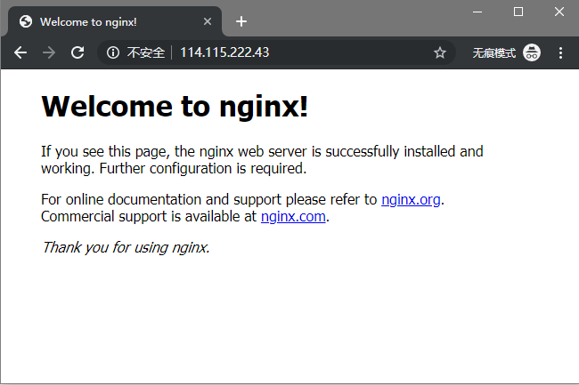

## Python配置

### 安装Python3.6

由于华为与服务器为Ubuntu Server 16.04只有Python3.5，所以添加了JonathonF的PPA

```
sudo add-apt-repository ppa:jonathonf/python-3.6
sudo apt update
sudo apt install python3.6 python3.6-dev python3.6-venv
```

### 安装pip

```
wget https://bootstrap.pypa.io/get-pip.py
python3.6 get-pip.py
```

### 创建Virtualenv并激活

```
python3.6 -m venv venv
source venv/bin/activate
```
### 安装uwsgi

```
pip install --upgrade pip
pip install uwsgi
```

## Nginx配置

编译安装nginx

```
apt install libpcre3-dev libssl-dev zlib1g-dev
wget http://nginx.org/download/nginx-1.16.0.tar.gz
tat -xvf nginx-1.16.0.tar.gz
cd nginx-1.16.0
./configure --prefix=/opt/nginx --with-http_ssl_module
make
make check
make install
```

简单运行Nginx并访问IP地址`http://114.115.222.43/`




编辑nginx配置并重新运行nginx

```
cd /opt/nginx/conf
cp nginx.conf nginx.conf.bak
nano nginx.conf
/opt/nginx/sbin/nginx
```
配置文件如下

```
user  root;
worker_processes  2;

events {
    worker_connections  1024;
}

http {
    upstream django {
        server 127.0.0.1:8000;
    }

    include       mime.types;
    default_type  application/octet-stream;
    sendfile        on;
    keepalive_timeout  65;
    gzip on;

    server {
        listen       80;
        server_name  localhost;

        charset utf-8,gbk;

        location /media {
            alias /opt/nginx/html/bookStore/src/static/media;
        }

        location /static/media {
            alias /opt/nginx/html/bookStore/src/static/media;
        }

        location /static {
            alias /opt/nginx/html/bookStore/src/static;
        }

        location / {
            uwsgi_pass django;
            include /opt/nginx/html/bookStore/src/BookStore/uwsgi_params;
        }

        #error_page  404              /404.html;

        # redirect server error pages to the static page /50x.html
        error_page   500 502 503 504  /50x.html;
        location = /50x.html {
            root   html;
        }
    }
}
```

## 部署Django项目

### 下载代码，安装依赖

```
cd /opt/nginx/html
git clone --depth=1 https://github.com/ndlteam/bookStore
cd bookStore
pip install -r requirements.txt
```

### 收集静态文件、配置uwsgi

```
cd src
python manage.py collectstatic
uwsgi --ini uwsgi.ini
```

### uwsgi配置文件

```
[uwsgi]
chdir=/opt/nginx/html/bookStore/src
module=BookStore.wsgi:application
socket=127.0.0.1:8000
processes=4
threads=2
```

## 服务部署成功示意图

