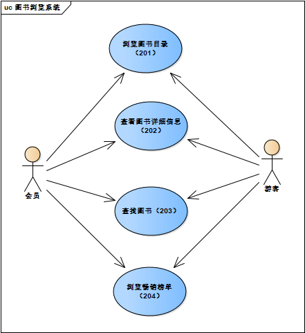
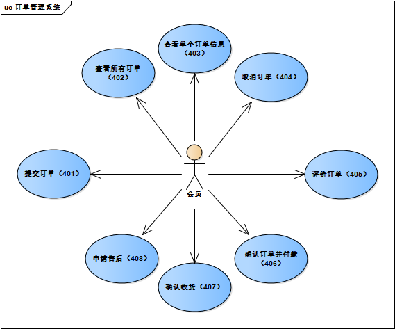

### 引言

#### 用户简介

"小型网上书店系统"的使用者主要有经销商和用户群两种

(1) 经销商，相对于实体书店，网络经销商有如下特点。

1. 营业时间不受限制，与传统的8小时营业时间不同，借助互联网，网上书店可以24小时全天候营业。这种不间断的服务方式对于巩固和扩大读者群，培育潜在的顾客具有重大意义。
2. 不受营业场地限制。因为"小型网上书店系统"是虚拟书店，所以它无须门市，只要维持面积有限的库房即可正常运转，并以最低的成本经营最多的品种。
3. 供需双方之间的信息交流的广度，深度和速度有了质的飞跃。可提供的图书信息与用户信息的相互沟通及匹配一直是制约图书销量增长的瓶颈，"小型网上书店系统"以其直观的界面，丰富的信息，灵活的检索方式和个性化的定制服务，成功地解决了这一难题。
4. 经营管理更加科学。现代信息技术的大量运用使得网上书店能够快捷地对业务数据进行采集，统计，分析，应用，这有助于克服传统营销模式中地主观性和盲目性，对于提高经营管理水平大有裨益。

(2) "小型网上书店系统"的用户群，该群体有如下特征。

1. 主流人群为经常上网的读书爱好者，拥有能够上网的条件，以青年和中年人为主。
2. 部分用户持有信用卡，可在网上直接付款；无信用卡的用户可以汇款进行交易。
3. 从职业划分来看，一部分用户是高校学生，追求时尚快捷的购物方式，购买力有限；另一部分则为工作人群，追求高效经济的购物方式，购买力较强。

#### 项目的目的与目标

##### 目的

通过"小型网上书店系统"实现图书销售的电子商务模式并满足经销商和用户进行电子交易的需求，保证充分发挥网上交易的优势。

##### 目标

1. "小型网上书店系统"各个功能完整。
2. 整个系统可以稳定运行。
3. 用户之间信息渠道畅通。
4. 用户可以迅速找到自己所需要的图书。
5. 付款渠道畅通。

#### 术语定义

[1] 管理员：本系统的后台管理者，可以对图书信息与会员信息进行管理

[2] 游客：没有注册的网站用户，只能浏览图书和查看图书详细信息，注册后可称为会员

[3] 会员：已注册的网站用户，具有游客除了注册之外的所有功能，还可以进行图书的购买操作与订单的管理操作

[4] 第三方支付系统：譬如微信或支付宝这样的第三方支付系统，用来支付相关费用

#### 参考资料

[1] 吕云翔.软件工程实用教程.北京:清华大学出版社，2015

#### 相关文档

[1] 《需求规格说明书》

[1] 《软件设计说明书》

#### 版本更新信息

​									表1.1 版本更新记录

| 版本号 | 创建者 | 创建日期  | 维护者 | 维护日期  | 维护纪要 |
| :----: | :----: | :-------: | :----: | :-------: | :------: |
|  v1.0  |  李楠  | 2019-3-20 | 刘子明 | 2019-4-20 |          |
|        |        |           |        |           |          |
|        |        |           |        |           |          |
|        |        |           |        |           |          |
|        |        |           |        |           |          |

### 现有系统描述

#### 角色定义

​									表2.1 角色定义

| 编号 |  角色  |
| :--: | :----: |
|  01  |  游客  |
|  02  |  会员  |
|  03  | 管理员 |

#### 作业流程

##### 总体工作图

##### 总体工作流程图

###### 用户角度

###### 管理员角度

##### 会员购书流程图

这里将本网站系统最终要的功能模块拿出来单独分析。其余功能模块基本可由用户角度的总体工作流程图概括。

#### 单据、账本和报表

##### 单据

暂无。

##### 账本

暂无。

##### 可能的变化

暂无。

### 非技术要求

1. 本系统的开发周期为三个月左右，开发流程为：需求分析，设计，编码实现，单元测试，集成和系统测试，交付，其中需求分析的更新贯穿于整个开发过程。

2. 要交付的工作产品有：软件开发计划书，需求规格说明书，软件设计说明书和测试分析报告，用户手册，源代码，可执行程序。

### 系统环境

#### 硬件运行环境

1. 服务器

 - CPU：Intel Xeon E5-2680 2.50GHz 以上

 - 内存：1GB及以上

 - 网络配置：网卡的传输速率为100Mbps及以上

2. Web浏览PC

 - CPU：AMD或Intel 1.6GHz以上

 - 内存：1GB及以上

 - 网络配置：网卡的传输速率为100Mbps及以上

#### 软件运行环境

1. 服务器

 - 操作系统：Linux（Kernel 4.0以上）

 - 数据库：MySQL-8.0.15

 - Web服务器：nginx、uWSGI

2. 客户机

 - 操作系统无限制，有网络，浏览器即可

#### 开发环境

1. 硬件环境

 - 本系统采用PC开发，配置如下：

 - 处理器： Intel(R) Core(TM) i7-8750H CPU @ 2.20GHz 2.21GHz

 - 内存（RAM）：8.0GB

 - 硬盘容量：500GB

2. 软件环境

服务器：

 - 操作系统：Linux（Kernel 4.0以上）

 - 数据库：MySQL-8.0.15

 - Web服务器：nginx、uWSGI

客户机：

 - 操作系统等均无限制，有浏览器，网络即可。

### 目标系统功能需求

#### 功能模块总体设计

#### 用例详细说明

##### 登录注册及个人信息维护系统

“登陆注册及个人信息维护系统”模块的用例图

对用例的说明如表所示。

<table>

“注册账号”用例

<tr>
<td width=20%>编号</td>
<td width=30%>101</td>
<td width=20%>用例名称</td>
<td width=30%>注册账号</td>
</tr>
<tr>
<td>使用人员</td>
<td>游客</td>
<td>扩展点</td>
<td>无</td>
</tr>
<tr>
<td>输入</td>
<td colspan=3>账号、密码、邮箱</td>
</tr>
<tr>
<td>系统响应</td>
<td colspan=3>系统在数据库中写入用户信息</td>
</tr>
<tr>
<td>输出</td>
<td colspan=3>用户可用注册时的用户名和密码登录</td>
</tr>
<tr>
<td rowspan=2>前置条件</td>
<td rowspan=2>游客申请注册</td>
<td rowspan=2>后置条件</td>
<td rowspan=2>游客成功注册为会员</td>
</tr>
<tr>
</tr>
<tr>
<td rowspan=6>活动步骤</td>
<td colspan=3>1.游客选择“注册”。</td>
</tr>
<tr>
<td colspan=3>2.系统返回“注册”页面。</td>
</tr>
<tr>
<td colspan=3>3.游客输入相关信息。</td>
</tr>
<tr>
<td colspan=3>4.系统验证注册信息。</td>
</tr>
<tr>
<td colspan=3>5.游客提交注册信息。</td>
</tr>
<tr>
<td colspan=3>6.系统提醒注册成功并返回首页。</td>
</tr>
<tr>
<td rowspan=2>异常处理</td>
<td colspan=3>1.游客输入的用户名已注册，或注册信息与系统验证不一致，系统返回注册页面并给出提示信息</td>
</tr>
<tr>
<td colspan=3>2.系统异常，无法注册给出相应的信息，如网站维护中。</td>
</tr>
</table>

<table>

“登录系统”用例

<tr>
<td width=20%>编号</td>
<td width=30%>102</td>
<td width=20%>用例名称</td>
<td width=30%>登录系统</td>
</tr>
<tr>
<td>使用人员</td>
<td>会员</td>
<td>扩展点</td>
<td>无</td>
</tr>
<tr>
<td>输入</td>
<td colspan=3>用户名和密码</td>
</tr>
<tr>
<td>系统响应</td>
<td colspan=3>用户的登录时间等相关信息存入数据库中</td>
</tr>
<tr>
<td>输出</td>
<td colspan=3>相关会员的页面</td>
</tr>
<tr>
<td>前置条件</td>
<td>该会员已注册</td>
<td>后置条件</td>
<td>该用户登录成功</td>
</tr>
<tr>
<td rowspan=4>活动步骤</td>
<td colspan=3>1.用户选择“登陆系统”选项</td>
</tr>
<tr>
<td colspan=3>2.系统处理返回“登录”页面。</td>
</tr>
<tr>
<td colspan=3>3.系统输入用户名、密码和验证码并提交。</td>
</tr>
<tr>
<td colspan=3>4.系统进行系统验证，验证成功，记录该用户为登录用户并返回主页面（表明该会员已登录）。</td>
</tr>
<tr>
<td rowspan=3>异常处理</td>
<td colspan=3>1.系统提示账号未被注册</td>
</tr>
<tr>
<td colspan=3>2.系统验证用户登录信息有错，提示用户重新登录。</td>
</tr>
<tr>
<td colspan=3>3.系统处理异常，系统给出相应的提示信息。</td></tr>
</table>

<table>

“找回密码”用例

<tr>
<td width=20%>编号</td>
<td width=30%>103</td>
<td width=20%>用例名称</td>
<td width=30%>找回密码</td>
</tr>
<tr>
<td>使用人员</td>
<td>会员</td>
<td>扩展点</td>
<td>输入用户名和密码提示</td>
<tr>
<td>输入</td>
<td colspan=3>用户注册时的邮箱号或密码提示问题</td>
</tr>
<tr>
<td>系统响应</td>
<td colspan=3>系统根据邮箱号或密码提示找到相应的用户并返回其对应的密码设置页面</td>
</tr>
<tr>
<td>输出</td>
<td colspan=3>用户重新设置自己的密码</td>
</tr>
<tr>
<td rowspan=2>前置条件</td>
<td rowspan=2>该用户成功注册</td>
<td rowspan=2>后置条件</td>
<td rowspan=2>系统返回重设密码页面</td>
</tr>
<tr>
</tr>
<tr>
<td rowspan=4>活动步骤</td>
<td colspan=3>1.用户选择“找回密码”选项</td>
</tr>
<tr>
<td colspan=3>2.系统返回“找回密码”页面。（要求用户输入注册时的邮箱号，系统自动发送邮件到用户的邮箱中，用户再根据邮箱中设置的链接重新设置密码。）</td>
</tr>
<tr>
<td colspan=3>3.用户输入新密码并提交。</td>
</tr>
<tr>
<td colspan=3>4.系统进行验证，验证成功，提示修改成功并跳转到登录页面</td>
</tr>
<tr>
<td rowspan=2>异常处理</td>
<td colspan=3>1.在扩展点中若用输入错误用户名或密码提示答案，则系统提示验证错误并返回登录页面</td>
</tr>
<tr>
<td colspan=3>2.系统处理异常，系统给出相应的提示信息。</td>
</tr>
</table>

<table>

“查看个人信息”用例

<tr>
<td width=20%>编号</td>
<td width=30%>104</td>
<td width=20%>用例名称</td>
<td width=30%>查看个人信息</td>
</tr>
<tr>
<td>使用人员</td>
<td>会员</td>
<td>扩展点</td>
<td>无</td>
<tr>
<td>输入</td>
<td colspan=3>系统自动转换，不需要输入</td>
</tr>
<tr>
<td>系统响应</td>
<td colspan=3>系统显示用户在数据库的个人信息</td>
</tr>
<tr>
<td>输出</td>
<td colspan=3>显示用户的个人信息</td>
</tr>
<tr>
<td rowspan=2>前置条件</td>
<td rowspan=2>该用户成功登录</td>
<td rowspan=2>后置条件</td>
<td rowspan=2>该用户查看个人信息成功</td>
</tr>
<tr>
</tr>
<tr>
<td rowspan=2>活动步骤</td>
<td colspan=3>1.用户选择“查看个人信息”选项</td>
</tr>
<tr>
<td colspan=3>2.系统返回“查看个人信息”页面。</td>
</tr>
<tr>
<td>异常处理</td>
<td colspan=3>系统处理异常，系统给出相应的提示信息。</td>
</tr>
</table>

<table>

“修改个人信息”用例

<tr>
<td width=20%>编号</td>
<td width=30%>105</td>
<td width=20%>用例名称</td>
<td width=30%>修改个人信息</td>
</tr>
<tr>
<td>使用人员</td>
<td>会员</td>
<td>扩展点</td>
<td>无</td>
<tr>
<td>输入</td>
<td colspan=3>用户输入个人相关信息</td>
</tr>
<tr>
<td>系统响应</td>
<td colspan=3>系统用现在的个人信息替换之前的个人信息</td>
</tr>
<tr>
<td>输出</td>
<td colspan=3>用户的个人信息显示被修改</td>
</tr>
<tr>
<td rowspan=2>前置条件</td>
<td rowspan=2>该用户成功登录</td>
<td rowspan=2>后置条件</td>
<td rowspan=2>该用户修改个人信息成功</td>
</tr>
<tr>
</tr>
<tr>
<td rowspan=4>活动步骤</td>
<td colspan=3>1.用户选择“修改个人信息”选项</td>
</tr>
<tr>
<td colspan=3>2.系统返回“修改个人信息”页面。</td>
</tr>
<tr>
<td colspan=3>3.修改相关信息并提交。</td>
</tr>
<tr>
<td colspan=3>4.系统进行验证，验证成功，提示修改成功</td>
</tr>
<tr>
<td rowspan=2>异常处理</td>
<td colspan=3>1.系统验证会员输入有误，提示重新输入并返回“修改个人信息”页面</td>
</tr>
<tr>
<td colspan=3>2.系统处理异常，系统给出相应的提示信息。</td>
</tr>
</table>

<table>

“用户注销”用例

<tr>
<td width=20%>编号</td>
<td width=30%>106</td>
<td width=20%>用例名称</td>
<td width=30%>用户注销</td>
</tr>
<tr>
<td>使用人员</td>
<td>会员</td>
<td>扩展点</td>
<td>无</td>
<tr>
<td>输入</td>
<td colspan=3>系统自动转换，不需要输入</td>
</tr>
<tr>
<td>系统响应</td>
<td colspan=3>系统自动修改用户在数据库中的相应状态</td>
</tr>
<tr>
<td>输出</td>
<td colspan=3>显示用户未登录</td>
</tr>
<tr>
<td rowspan=2>前置条件</td>
<td rowspan=2>该用户成功登录</td>
<td rowspan=2>后置条件</td>
<td rowspan=2>用户成功注销</td>
</tr>
<tr>
</tr>
<tr>
<td rowspan=2>活动步骤</td>
<td colspan=3>1.用户选择“用户注销”选项</td>
</tr>
<tr>
<td colspan=3>2.系统提示用户成功注销并返回网站首页。</td>
</tr>
<tr>
<td>异常处理</td>
<td colspan=3>系统异常，并给出相应的提示信息</td>
</tr>
</table>

<table>

“管理会员信息”用例

<tr>
<td width=20%>编号</td>
<td width=30%>107</td>
<td width=20%>用例名称</td>
<td width=30%>管理会员信息</td>
</tr>
<tr>
<td>使用人员</td>
<td>管理员</td>
<td>扩展点</td>
<td>无</td>
<tr>
<td>输入</td>
<td colspan=3>系统自动转换，不需要输入</td>
</tr>
<tr>
<td>系统响应</td>
<td colspan=3>系统自动修改会员的权限</td>
</tr>
<tr>
<td>输出</td>
<td colspan=3>显示用户权限被修改</td>
</tr>
<tr>
<td rowspan=2>前置条件</td>
<td rowspan=2>该用户成功登录</td>
<td rowspan=2>后置条件</td>
<td rowspan=2>用户权限被限制</td>
</tr>
<tr>
</tr>
<tr>
<td rowspan=3>活动步骤</td>
<td colspan=3>1.管理员选择“管理用户权限”选项</td>
</tr>
<tr>
<td colspan=3>2.管理员选择用户和被限制的权限。</td>
</tr>
<tr>
<td colspan=3>3.系统提示用户权限限制成功。</td>
</tr>
<tr>
<td>异常处理</td>
<td colspan=3>系统异常，并给出相应的提示信息</td>
</tr>
</table>

##### 图书浏览系统

浏览图书的用例图如图所示。

“图书浏览系统”模块的用例图

对用例的说明如表所示。

<table>

“浏览图书目录”用例

<tr>
<td width=20%>编号</td>
<td width=30%>201</td>
<td width=20%>用例名称</td>
<td width=30%>浏览图书目录</td>
</tr>
<tr>
<td>使用人员</td>
<td>游客、会员</td>
<td>扩展点</td>
<td>无</td>
</tr>
<tr>
<td>输入</td>
<td colspan=3>系统自动转换，不需要输入</td>
</tr>
<tr>
<td>系统响应</td>
<td colspan=3>系统自动切换页面</td>
</tr>
<tr>
<td>输出</td>
<td colspan=3>显示相应的图书目录页面</td>
</tr>
<tr>
<td rowspan=2>前置条件</td>
<td>用户在本系统中选择了</td>
<td rowspan=2>后置条件</td>
<td rowspan=2>用户成功浏览图书目录</td>
</tr>
<tr>
<td>“浏览图书目录”项</td>
</tr>
<tr>
<td rowspan=2>活动步骤</td>
<td colspan=3>1.用户选择“浏览图书目录”，或者输入查看的图书信息。</td>
</tr>
<tr>
<td colspan=3>2.系统处理用户请求成功并返回用户查看的相应图书目录页面。</td>
</tr>
<tr>
<td>异常处理</td>
<td colspan=3>系统在数据鲁中没有找到与用户输入相关的信息，系统给出相应的提示</td>
</tr>
</table>

<table>

“查看图书详细信息”用例

<tr>
<td width=20%>编号</td>
<td width=30%>202</td>
<td width=20%>用例名称</td>
<td width=30%>查看图书详细信息</td>
</tr>
<tr>
<td>使用人员</td>
<td>游客、会员</td>
<td>扩展点</td>
<td>无</td>
</tr>
<tr>
<td>输入</td>
<td colspan=3>系统自动转换，不需要输入</td>
</tr>
<tr>
<td>系统响应</td>
<td colspan=3>系统自动切换页面</td>
</tr>
<tr>
<td>输出</td>
<td colspan=3>显示相应的图书信息页面</td>
</tr>
<tr>
<td rowspan=2>前置条件</td>
<td rowspan=2>用户必须在浏览商品目录时查看某个商品的详细信息</td>
<td rowspan=2>后置条件</td>
<td rowspan=2>用户查看图书</td>
</tr>
<tr>
</tr>
<tr>
<td rowspan=2>活动步骤</td>
<td colspan=3>1.用户选择查看图书的详细信息</td>
</tr>
<tr>
<td colspan=3>2.系统返回图书的详细信息</td>
</tr>
<tr>
<td>异常处理</td>
<td colspan=3>该数据暂时无详细信息，系统会给出相应的提示信息</td>
</tr>
</table>

<table>

“查找图书”用例

<tr>
<td width=20%>编号</td>
<td width=30%>203</td>
<td width=20%>用例名称</td>
<td width=30%>查找图书</td>
</tr>
<tr>
<td>使用人员</td>
<td>会员</td>
<td>扩展点</td>
<td>无</td>
</tr>
<tr>
<td>输入</td>
<td colspan=3>图书的相关信息</td>
</tr>
<tr>
<td>系统响应</td>
<td colspan=3>系统在数据库中查找相关的图书</td>
</tr>
<tr>
<td>输出</td>
<td colspan=3>系统查找成功返回相应的图书信息页面，或系统提示用户未找到</td>
</tr>
<tr>
<td rowspan=2>前置条件</td>
<td rowspan=2>必须是已登录的会员</td>
<td rowspan=2>后置条件</td>
<td rowspan=2>用户查看图书信息成功</td>
</tr>
<tr>
</tr>
<tr>
<td rowspan=2>活动步骤</td>
<td colspan=3>1.用户选择“查找图书”选项，输入图书的相关信息</td>
</tr>
<tr>
<td colspan=3>2.系统处理返回相应的图书页面。</td>
</tr>
<tr>
<td rowspan=2>异常处理</td>
<td colspan=3>1.系统提示暂无此图书</td>
</tr>
<tr>
<td colspan=3>2.系统处理异常，系统给出相应的提示信息。</td>
</tr>

<table>

“浏览畅销榜单”用例

<tr>
  <td width=20%>编号</td>
  <td width=30%>204</td>
  <td width=20%>用例名称</td>
  <td width=30%>浏览畅销榜单</td>
 </tr>
 <tr>
  <td>使用人员</td>
  <td>游客、会员</td>
  <td>扩展点</td>
  <td>无</td>
 </tr>
 <tr>
  <td>输入</td>
  <td colspan=3>系统自动显示，无需输入</td>
 </tr>
 <tr>
  <td>系统响应</td>
  <td colspan=3>系统在数据库中按一定顺序排列查找到的图书</td>
 </tr>
 <tr>
  <td>输出</td>
  <td colspan=3>系统查找成功返回相应的图书信息页面，或系统提示用户未找到</td>
 </tr>
 <tr>
  <td rowspan=2>前置条件</td>
  <td rowspan=2>选择查看热销榜单</td>
  <td rowspan=2>后置条件</td>
  <td rowspan=2>用户查看榜单成功</td>
 </tr>
 <tr>
 </tr>
 <tr>
  <td rowspan=2>活动步骤</td>
  <td colspan=3>1.用户选择“浏览热销榜单”选项，输入相关类别</td>
 </tr>
 <tr>
  <td colspan=3>2.系统处理返回相应的图书列表页面。</td>
 </tr>
 <tr>
  <td rowspan=2>异常处理</td>
  <td colspan=3>1.系统提示暂无热销图书</td>
 </tr>
 <tr>
  <td colspan=3>2.系统处理异常，系统给出相应的提示信息。</td>
 </tr>
</table>

##### 会员购书系统

会员购书的用例图如图所示。

“会员购书系统”模块的用例图

对用例的说明如表所示。

<table>

“购买图书”用例

<tr>
<td width=20%>编号</td>
<td width=30%>301</td>
<td width=20%>用例名称</td>
<td width=30%>购买图书</td>
</tr>
<tr>
<td>使用人员</td>
<td>会员</td>
<td>扩展点</td>
<td>用户选择“继续购买”，系统返回购买图书的页面</td>
</tr>
<tr>
<td>输入</td>
<td colspan=3>系统自动转换不需要输入</td>
</tr>
<tr>
<td>系统响应</td>
<td colspan=3>系统将相应图书信息添加到数据库中，并跳转到购物车页面结算</td>
</tr>
<tr>
<td>输出</td>
<td colspan=3>购物车页面中新增相应图书信息</td>
</tr>
<tr>
<td>前置条件</td>
<td>用户必须是已注册并已登录的会员</td>
<td>后置条件</td>
<td>用户添加相关书籍至购物车并跳转至购物车页面结算</td>
</tr>
<tr>
<td rowspan=4>活动步骤</td>
<td colspan=3>1.用户在看中的图书中选择“购买图书”。</td>
</tr>
<tr>
<td colspan=3>2.系统添加相关图书信息，跳转到购物车页面，让用户选择结账或者继续购买。</td>
</tr>
<tr>
<td colspan=3>3.用户选择“结账”，跳转到第三方支付系统页面结账。</td>
</tr>
<tr>
<td colspan=3>4.系统返回购物车页面。</td>
</tr>
<tr>
<td rowspan=2>异常处理</td>
<td colspan=3>1.用户未登录，返回登陆页面。</td>
</tr>
<tr>
<td colspan=3>2.系统异常，系统给出相应的提示。</td>
</tr>
</table>

<table>

“添加图书”用例

<tr>
<td width=20%>编号</td>
<td width=30%>302</td>
<td width=20%>用例名称</td>
<td width=30%>添加图书</td>
</tr>
<tr>
<td>使用人员</td>
<td>会员</td>
<td>扩展点</td>
<td>无</td>
</tr>
<tr>
<td>输入</td>
<td colspan=3>会员输入要添加图书的数量</td>
</tr>
<tr>
<td>系统响应</td>
<td colspan=3>系统将相应图书信息添加到数据库中</td>
</tr>
<tr>
<td>输出</td>
<td colspan=3>购物车页面中新增相应图书信息</td>
</tr>
<tr>
<td>前置条件</td>
<td>用户必须是已注册并已登录的会员</td>
<td>后置条件</td>
<td>用户添加图书成功</td>
</tr>
<tr>
<td rowspan=2>活动步骤</td>
<td colspan=3>1.用户在看中的图书中选择“添加图书”。</td>
</tr>
<tr>
<td colspan=3>2.系统添加相关图书信息，并提示已添加成功。</td>
</tr>
<tr>
<td rowspan=2>异常处理</td>
<td colspan=3>1.用户未登录，返回登陆页面。</td>
</tr>
<tr>
<td colspan=3>2.系统异常，系统给出相应的提示。</td>
</tr>
</table>

<table>

“查看购物车”用例

<tr>
<td width=20%>编号</td>
<td width=30%>303</td>
<td width=20%>用例名称</td>
<td width=30%>查看购物车</td>
</tr>
<tr>
<td>使用人员</td>
<td>会员</td>
<td>扩展点</td>
<td>无</td>
</tr>
<tr>
<td>输入</td>
<td colspan=3>系统自动转换，不需要输入</td>
</tr>
<tr>
<td>系统响应</td>
<td colspan=3>系统自动切换页面</td>
</tr>
<tr>
<td>输出</td>
<td colspan=3>相应会员的购物车页面</td>
</tr>
<tr>
<td rowspan=2>前置条件</td>
<td>用户选择“查看购物车”项</td>
<td rowspan=2>后置条件</td>
<td rowspan=2>用户添加图书成功</td>
</tr>
<tr>
<td>系统返回购物车页面</td>
</tr>
<tr>
<td rowspan=2>活动步骤</td>
<td colspan=3>1.用户在看中的图书中选择“添加图书”。</td>
</tr>
<tr>
<td colspan=3>2.系统添加相关图书信息，并提示已添加成功。</td>
</tr>
<tr>
<td rowspan=3>异常处理</td>
<td colspan=3>1.该用户不是会员，系统给出提示，要求此用户先登录，并返回登录页面。</td>
</tr>
<tr>
<td colspan=3>2.系统给出一个提示：该购物车内没有图书。</td>
</tr>
<tr>
<td colspan=3>3.系统异常，系统给出相应的提示。</td>
</tr>
</table>

<table>

“删除图书”用例

<tr>
<td width=20%>编号</td>
<td width=30%>304</td>
<td width=20%>用例名称</td>
<td width=30%>删除图书</td>
</tr>
<tr>
<td>使用人员</td>
<td>会员</td>
<td>扩展点</td>
<td>无</td>
</tr>
<tr>
<td>输入</td>
<td colspan=3>系统自动转换，不需要输入</td>
</tr>
<tr>
<td>系统响应</td>
<td colspan=3>系统将相应的图书信息从数据库中删除</td>
</tr>
<tr>
<td>输出</td>
<td colspan=3>购物车中界面中相应的图书信息消失</td>
</tr>
<tr>
<td rowspan=3>前置条件</td>
<td>该用户是已登录的会员</td>
<td rowspan=3>后置条件</td>
<td rowspan=3>相应的图书被删除</td>
</tr>
<tr>
<td>购物车中含有图书</td>
</tr>
<tr>
<td>在购物车管理页面中选择“删除图书”</td>
</tr>
<tr>
<td rowspan=2>活动步骤</td>
<td colspan=3>1.会员选择“购物车管理”，选中相应的图书，单击“删除图书”。</td>
</tr>
<tr>
<td colspan=3>2.系统提示会员删除成功，并返回购物车页面。</td>
</tr>
<tr>
<td>异常处理</td>
<td colspan=3>1.系统异常，系统给出相应的提示信息。</td>
</tr>
</table>

<table>

“修改图书数量”用例

<tr>
<td width=20%>编号</td>
<td width=30%>305</td>
<td width=20%>用例名称</td>
<td width=30%>修改图书数量</td>
</tr>
<tr>
<td>使用人员</td>
<td>会员</td>
<td>扩展点</td>
<td>无</td>
</tr>
<tr>
<td>输入</td>
<td colspan=3>会员输入要修改的图书的数量</td>
</tr>
<tr>
<td>系统响应</td>
<td colspan=3>系统对数据库中相应图书的数量进行修改</td>
</tr>
<tr>
<td>输出</td>
<td colspan=3>购物车页面内相应图书的数量被修改</td>
</tr>
<tr>
<td rowspan=2>前置条件</td>
<td>该用户是已登录的会员</td>
<td rowspan=2>后置条件</td>
<td rowspan=2>购物车内相应图书的数量被成功修改</td>
</tr>
<tr>
<td>购物车内不能为空</td>
</tr><tr>
<td rowspan=4>活动步骤</td>
<td colspan=3>1.用户选择购物车并对相关图书的数量做出修改。</td>
</tr>
<tr>
<td colspan=3>2.系统返回确认修改信息。</td>
</tr>
<tr>
<td colspan=3>3.用户选择“确认”。</td>
</tr>
<tr>
<td colspan=3>4.系统提示修改成功并返回购物车。</td>
</tr>
<tr>
<td rowspan=3>异常处理</td>
<td colspan=3>1.系统异常，系统给出相应的提示信息。</td>
</tr>
<tr>
<td colspan=3>2.用户取消修改。</td>
</tr>
<tr>
<td colspan=3>3.系统异常，系统给出相应的提示信息。</td>
</tr>
</table>

<table>

“清空购物车”用例

<tr>
<td width=20%>编号</td>
<td width=30%>306</td>
<td width=20%>用例名称</td>
<td width=30%>清空购物车</td>
</tr>
<tr>
<td>使用人员</td>
<td>会员</td>
<td>扩展点</td>
<td>无</td>
</tr>
<tr>
<td>输入</td>
<td colspan=3>系统自动转换，不需要输入</td>
</tr>
<tr>
<td>系统响应</td>
<td colspan=3>系统将所有图书信息从相应的数据库中删除</td>
</tr>
<tr>
<td>输出</td>
<td colspan=3>购物车页面中的图书为空</td>
</tr>
<tr>
<td rowspan=2>前置条件</td>
<td>该用户为已登录的用户</td>
<td rowspan=2>后置条件</td>
<td rowspan=2>用户添加图书成功</td>
</tr>
<tr>
<td>购物车内不能为空</td>
</tr>
<tr>
<td rowspan=2>活动步骤</td>
<td colspan=3>1.用户选择“购物车管理”并单击“清空购物车”。</td>
</tr>
<tr>
<td colspan=3>2.系统提示购物车已清空，并返回购物车页面。</td>
</tr>
<tr>
<td rowspan=2>异常处理</td>
<td colspan=3>1.购物车为空，系统给出相应的提示信息。</td>
</tr>
<tr>
<td colspan=3>2.系统异常，系统给出相应的提示信息。</td>
</table>

##### 订单管理系统

订单管理系统用例图如图所示。

“订单管理系统”模块的用例图

对用例的说明如表所示。

<table>

提交订单”的用例

<tr>
<td width=20%>编号</td>
<td width=30%>401</td>
<td width=20%>用例名称</td>
<td width=30%>提交订单</td>
</tr>
<tr>
<td>使用人员</td>
<td>会员</td>
<td>扩展点</td>
<td>无</td>
</tr>
<tr>
<td>输入</td>
<td colspan=3>系统自动转换，不需要输入</td>
</tr>
<tr>
<td>系统响应</td>
<td colspan=3>系统自动修改数据库中相应的信息</td>
</tr>
<tr>
<td>输出</td>
<td colspan=3>订单信息存在相应的订单中</td>
</tr>
<tr>
<td rowspan=2>前置条件</td>
<td>该用户为已成功登陆的会员</td>
<td rowspan=2>后置条件</td>
<td rowspan=2>会员提交订单成功</td>
</tr>
<tr>
<td>会员购物车内不能为空</td>
</tr>
<tr>
<td rowspan=4>活动步骤</td>
<td colspan=3>1.会员确认购买提交</td>
</tr>
<tr>
<td colspan=3>2.系统返回支付界面（如收货人信息、送货方式、信用卡号、密码、是否开发票和备注说明等）</td>
</tr>
<tr>
<td colspan=3>3.会员填写并提交</td>
</tr>
<tr>
<td colspan=3>4.系统处理支付并提示结账成功然后给出购买信息</td>
</tr>
<tr>
<td rowspan=3>异常处理</td>
<td colspan=3>1.购物车为空，系统给出相应的提示信息</td>
</tr>
<tr>
<td colspan=3>2.信用卡处理支付失败，系统给出相应的提示信息</td>
</tr>
<tr>
<td colspan=3>3.系统处理异常，系统给出相应的提示信息</td>
</tr>
</table>

<table>

“查看所有订单”的用例

<tr>
<td width=20%>编号</td>
<td width=30%>402</td>
<td width=20%>用例名称</td>
<td width=30%>查看所有订单</td>
</tr>
<tr>
<td>使用人员</td>
<td>会员</td>
<td>扩展点</td>
<td>无</td>
</tr>
<tr>
<td>输入</td>
<td colspan=3>系统自动转换，不需要输入</td>
</tr>
<tr>
<td>系统响应</td>
<td colspan=3>系统返回订单目录页面</td>
</tr>
<tr>
<td>输出</td>
<td colspan=3>系统显示订单目录页面</td>
</tr>
<tr>
<td rowspan=2>前置条件</td>
<td>该用户为已成功登陆的会员</td>
<td rowspan=2>后置条件</td>
<td rowspan=2>会员查看所有订单成功</td>
</tr>
<tr>
<td>会员在该系统中下过订单</td>
</tr>
<tr>
<td rowspan=2>活动步骤</td>
<td colspan=3>1.会员单击“查看订单”项</td>
</tr>
<tr>
<td colspan=3>2.系统返回订单目录界面</td>
</tr>
<tr>
<td rowspan=2>异常处理</td>
<td colspan=3>1.系统提示无订单</td>
</tr>
<tr>
<td colspan=3>2.系统处理异常，系统给出相应的提示信息</td>
</tr>
</table>

<table>

“查看单个订单”的用例

<tr>
<td width=20%>编号</td>
<td width=30%>403</td>
<td width=20%>用例名称</td>
<td width=30%>查看单个订单信息</td>
</tr>
<tr>
<td>使用人员</td>
<td>会员</td>
<td>扩展点</td>
<td>无</td>
</tr>
<tr>
<td>输入</td>
<td colspan=3>系统自动转换，不需要输入</td>
</tr>
<tr>
<td>系统响应</td>
<td colspan=3>系统返回相应的订单信息页面</td>
</tr>
<tr>
<td>输出</td>
<td colspan=3>系统显示相应的订单信息</td>
</tr>
<tr>
<td rowspan=2>前置条件</td>
<td>该用户为已成功登陆的会员</td>
<td rowspan=2>后置条件</td>
<td rowspan=2>会员查看该订单成功</td>
</tr>
<tr>
<td>会员拥有该订单</td>
</tr>
<tr>
<td rowspan=2>活动步骤</td>
<td colspan=3>1.会员单击相应的订单</td>
</tr>
<tr>
<td colspan=3>2.系统返回该订单的详细信息</td>
</tr>
<tr>
<td>异常处理</td>
<td colspan=3>系统处理异常，系统给出相应的提示信息</td>
</tr>
</table>

<table>

“取消订单”的用例

<tr>
<td width=20%>编号</td>
<td width=30%>404</td>
<td width=20%>用例名称</td>
<td width=30%>取消订单</td>
</tr>
<tr>
<td>使用人员</td>
<td>会员</td>
<td>扩展点</td>
<td>无</td>
</tr>
<tr>
<td>输入</td>
<td colspan=3>系统自动转换，不需要输入</td>
</tr>
<tr>
<td>系统响应</td>
<td colspan=3>系统对数据库中相应的订单信息进行删除</td>
</tr>
<tr>
<td>输出</td>
<td colspan=3>系统显示相应的订单被取消</td>
</tr>
<tr>
<td rowspan=2>前置条件</td>
<td>该用户为已成功登陆的会员</td>
<td rowspan=2>后置条件</td>
<td rowspan=2>会员取消该订单成功</td>
</tr>
<tr>
<td>会员拥有该订单</td>
</tr>
<tr>
<td rowspan=4>活动步骤</td>
<td colspan=3>1.会员单击“取消订单”</td>
</tr>
<tr>
<td colspan=3>2.系统返回确认取消提示</td>
</tr>
<tr>
<td colspan=3>3.会员确认取消</td>
</tr>
<tr>
<td colspan=3>4.系统提示已经取消该订单，并返回订单目录页面</td>
</tr>
<tr>
<td rowspan=2>异常处理</td>
<td colspan=3>1.该订单取消的时间已过，会员不能取消该订单</td>
</tr>
<tr>
<td colspan=3>2.系统处理异常，系统给出相应的提示信息</td>
</tr>
</table>

<table>

“评价订单”的用例

<tr>
<td width=20%>编号</td>
<td width=30%>405</td>
<td width=20%>用例名称</td>
<td width=30%>评价订单</td>
</tr>
<tr>
<td>使用人员</td>
<td>会员</td>
<td>扩展点</td>
<td>无</td>
</tr>
<tr>
<td>输入</td>
<td colspan=3>用户输入评价信息</td>
</tr>
<tr>
<td>系统响应</td>
<td colspan=3>系统自动修改数据库中相应订单的评价信息</td>
</tr>
<tr>
<td>输出</td>
<td colspan=3>系统显示相应的订单被评价</td>
</tr>
<tr>
<td rowspan=2>前置条件</td>
<td>该用户为已成功登陆的会员</td>
<td rowspan=2>后置条件</td>
<td rowspan=2>会员评价该订单成功</td>
</tr>
<tr>
<td>
会员拥有该订单
</td>
</tr>
<tr>
<td rowspan=4>活动步骤</td>
<td colspan=3>1.会员单击“评价订单”</td>
</tr>
<tr>
<td colspan=3>2.会员输入评论的信息</td>
</tr>
<tr>
<td colspan=3>3.用户完成输入，点击发布评价按钮</td>
</tr>
<tr>
<td colspan=3>4.评价成功，返回原界面</td>
</tr>
<tr>
<td rowspan=2>异常处理</td>
<td colspan=3>1.会员未登录，则没有此权限</td>
</tr>
<tr>
<td colspan=3>2.系统处理异常，系统给出相应的提示信息</td>
</tr>
</tr>
</table>

<table>

“确认订单并付款”的用例

<tr>
<td width=20%>编号</td>
<td width=30%>406</td>
<td width=20%>用例名称</td>
<td width=30%>确认订单并付款</td>
</tr>
<tr>
<td>使用人员</td>
<td>会员</td>
<td>扩展点</td>
<td>无</td>
</tr>
<tr>
<td>输入</td>
<td colspan=3>系统自动转换，不需要输入</td>
</tr>
<tr>
<td>系统响应</td>
<td colspan=3>系统自动修改数据库中相应订单的付款信息</td>
</tr>
<tr>
<td>输出</td>
<td colspan=3>系统显示相应的订单已下单</td>
</tr>
<tr>
<td rowspan=2>前置条件</td>
<td rpwspan=2>该用户为已成功登陆的会员</td>
<td rowspan=2>后置条件</td>
<td rowspan=2>会员确认订单成功、付款成功</td>
</tr>
<tr>
<td>
会员提交过该订单
</td>
</tr>
<tr>
<td rowspan=4>活动步骤</td>
<td colspan=3>1.会员确认购买提交</td>
</tr>
<tr>
<td colspan=3>2.系统返回支付页面（如收货人信息、送货方式、信用卡号、密码、是否开发发票和备注说明等）</td>
</tr>
<tr>
<td colspan=3>3.会员填写并提交</td>
</tr>
<tr>
<td colspan=3>4.系统处理支付并提示结账成功然后给出购买信息</td>
</tr>
<tr>
<td rowspan=3>异常处理</td>
<td colspan=3>1.信用系统处理支付失败，系统给出相应的提示信息</td>
</tr>
<tr>
<td colspan=3>2.该订单确认时间已过，系统自动取消订单</td>
</tr>
    <tr>
<td colspan=3>3.系统处理异常，系统给出相应的提示信</td>
</tr>
</tr>
</table>

<table>

“确认收货”的用例

<tr>
<td width=20%>编号</td>
<td width=30%>407</td>
<td width=20%>用例名称</td>
<td width=30%>确认收货</td>
</tr>
<tr>
<td>使用人员</td>
<td>会员</td>
<td>扩展点</td>
<td>无</td>
</tr>
<tr>
<td>输入</td>
<td colspan=3>系统自动转换，不需要输入</td>
</tr>
<tr>
<td>系统响应</td>
<td colspan=3>系统自动修改数据库中相应订单的收货信息</td>
</tr>
<tr>
<td>输出</td>
<td colspan=3>系统显示相应的订单已完成</td>
</tr>
<tr>
<td rowspan=2>前置条件</td>
<td>该用户为已成功登陆的会员</td>
<td rowspan=2>后置条件</td>
<td rowspan=2>会员确认收货成功</td>
</tr>
<tr>
<td>
会员拥有该订单
</td>
</tr>
<tr>
<td rowspan=4>活动步骤</td>
<td colspan=3>1.会员点击 “确认收货”</td>
</tr>
<tr>
<td colspan=3>2.系统返回确认收货的提示</td>
</tr>
<tr>
<td colspan=3>3.会员确认收货</td>
</tr>
<tr>
<td colspan=3>4.系统提示用户确认收货成功，此笔交易结束，并返回主页面</td>
</tr>
<tr>
<td rowspan=2>异常处理</td>
<td colspan=3>1.该订单确认收货的时间已过，系统自动确认收货</td>
</tr>
<tr>
<td colspan=3>2.系统处理异常，系统给出相应的提示信息</td>
</tr>
</tr>
</table>

<table>

“申请售后”的用例

<tr>
<td width=20%>编号</td>
<td width=30%>408</td>
<td width=20%>用例名称</td>
<td width=30%>申请售后</td>
</tr>
<tr>
<td>使用人员</td>
<td>会员</td>
<td>扩展点</td>
<td>无</td>
</tr>
<tr>
<td>输入</td>
<td colspan=3>系统自动转换，不需要输入</td>
</tr>
<tr>
<td>系统响应</td>
<td colspan=3>系统自动修改数据库中相应订单的售后信息</td>
</tr>
<tr>
<td>输出</td>
<td colspan=3>系统显示相应的订单的售后申请</td>
</tr>
<tr>
<td rowspan=2>前置条件</td>
<td>该用户为已成功登陆的会员</td>
<td rowspan=2>后置条件</td>
<td rowspan=2>会员申请售后成功</td>
</tr>
<tr>
<td>
会员拥有该订单
</td>
</tr>
<tr>
<td rowspan=4>活动步骤</td>
<td colspan=3>1.会员单击“申请售后”</td>
</tr>
<tr>
<td colspan=3>2.会员输入申请售后的信息</td>
</tr>
<tr>
<td colspan=3>3.用户完成输入，点击确认申请</td>
</tr>
<tr>
<td colspan=3>4.申请成功，返回原界面</td>
</tr>
<tr>
<td rowspan=2>异常处理</td>
<td colspan=3>1.会员未登录，则没有此权限</td>
</tr>
<tr>
<td colspan=3>2.系统处理异常，系统给出相应的提示信息</td>
</tr>
</table>

##### 图书管理系统

图书管理的用例图如图所示。

<table>
 
“查询图书”用例

 <tr>
  <td width=20%>编号</td>
  <td width=30%>501</td>
  <td width=20%>用例名称</td>
  <td width=30%>查询图书</td>
 </tr>
 <tr>
  <td>使用人员</td>
  <td>管理员</td>
  <td>扩展点</td>
  <td>无</td>
 </tr>
 <tr>
  <td>输入</td>
  <td colspan=3>图书的相关信息</td>
 </tr>
 <tr>
  <td>系统响应</td>
  <td colspan=3>系统在数据库中查找相关的图书</td>
 </tr>
 <tr>
  <td>输出</td>
  <td colspan=3>系统查找成功返回相应的图书信息页面，或系统提示用户未找到</td>
 </tr>
 <tr>
  <td rowspan=2>前置条件</td>
  <td>该用户必须是已登录的管理员</td>
  <td rowspan=2>后置条件</td>
  <td rowspan=2>管理员查询图书信息成功</td>
 </tr>
 <tr>
 	<td>该管理员用户有此权限</td>   
 </tr>
 <tr>
  <td rowspan=2>活动步骤</td>
  <td colspan=3>1.管理员选择“查看图书”选项。</td>
 </tr>
 <tr>
  <td colspan=3>2.系统处理，返回相应图书页面（如图书名称、图书作者、图书价格、图书出版社、入库时间和图书库存等数据库中具有的相应的信息）。</td>
 </tr>
 <tr>
  <td rowspan=2>异常处理</td>
  <td colspan=3>1.系统提示暂无此图书。</td>
 </tr>
 <tr>
  <td colspan=3>2.系统提示查询异常，给出相应的提示信息。</td>
 </tr>
</table>

<table>
 
“添加图书”用例

 <tr>
  <td width=20%>编号</td>
  <td width=30%>502</td>
  <td width=20%>用例名称</td>
  <td width=30%>添加图书</td>
 </tr>
 <tr>
  <td>使用人员</td>
  <td>管理员</td>
  <td>扩展点</td>
  <td>无</td>
 </tr>
 <tr>
  <td>输入</td>
  <td colspan=3>图书的相关信息</td>
 </tr>
 <tr>
  <td>系统响应</td>
  <td colspan=3>系统将相关图书的信息存入数据库中</td>
 </tr>
 <tr>
  <td>输出</td>
  <td colspan=3>系统提示用户添加成功或失败</td>
 </tr>
 <tr>
  <td rowspan=2>前置条件</td>
  <td>该用户必须是已登录的管理员</td>
  <td rowspan=2>后置条件</td>
  <td rowspan=2>管理员添加此图书信息成功</td>
 </tr>
 <tr>
 	<td>数据库中无此图书信息</td>   
 </tr>
 <tr>
  <td rowspan=2>活动步骤</td>
  <td colspan=3>1.管理员提交添加图书信息（如图书名称、图书作者、图书价格、图书出版社、入库时间和图书库存等数据库中具有的相应信息）。</td>
 </tr>
 <tr>
  <td colspan=3>2.系统处理并提示添加图书信息成功。</td>
 </tr>
 <tr>
  <td rowspan=2>异常处理</td>
  <td colspan=3>1.添加失败，数据库中已存在该图书信息。</td>
 </tr>
 <tr>
  <td colspan=3>2.系统提示查询异常，给出相应的提示信息。</td>
 </tr>
</table>

<table>
 
“删除图书”用例

 <tr>
  <td width=20%>编号</td>
  <td width=30%>503</td>
  <td width=20%>用例名称</td>
  <td width=30%>删除图书</td>
 </tr>
<tr>
  <td rowspan=2>使用人员</td>
  <td rowspan=2>管理员</td>
  <td rowspan=2>扩展点</td>
  <td>管理员选中要删除的图书单机“删除”按钮。</td>
 </tr>
 <tr>
 	<td>系统处理请求并提示删除成功。</td>   
 </tr>
 <tr>
  <td>输入</td>
  <td colspan=3>相关图书的关键信息</td>
 </tr>
 <tr>
  <td>系统响应</td>
  <td colspan=3>系统将数据库中相应的图书信息删除</td>
 </tr>
 <tr>
  <td>输出</td>
  <td colspan=3>系统提示用户删除成功或失败</td>
 </tr>
 <tr>
  <td rowspan=2>前置条件</td>
  <td>该用户必须是已登录的管理员</td>
  <td rowspan=2>后置条件</td>
  <td rowspan=2>管理员删除相应的图书信息成功</td>
 </tr>
 <tr>
 	<td>数据库中有此图书的相应信息</td>   
 </tr>
 <tr>
  <td rowspan=2>活动步骤</td>
  <td colspan=3>1.管理员提交要删除的图书名称或ISBN等有关图书的关键信息。</td>
 </tr>
 <tr>
  <td colspan=3>2.系统处理请求并提示删除成功。</td>
 </tr>
 <tr>
  <td rowspan=2>异常处理</td>
  <td colspan=3>1.系统返回删除失败，数据库中已五此图书信息。</td>
 </tr>
 <tr>
  <td colspan=3>2.系统处理异常，系统给出相应的提示信息。</td>
 </tr>
</table>

<table>

“修改图书”用例

 <tr>
  <td width=20%>编号</td>
  <td width=30%>504</td>
  <td width=20%>用例名称</td>
  <td width=30%>修改图书</td>
 </tr>
 <tr>
  <td>使用人员</td>
  <td>管理员</td>
  <td>扩展点</td>
  <td>无</td>
 </tr>
 <tr>
  <td>输入</td>
  <td colspan=3>要修改图书的相关信息</td>
 </tr>
 <tr>
  <td>系统响应</td>
  <td colspan=3>系统在数据库中用修改后的信息替换原来相应图书的信息</td>
 </tr>
 <tr>
  <td>输出</td>
  <td colspan=3>系统提示用户修改成功或失败</td>
 </tr>
 <tr>
  <td rowspan=2>前置条件</td>
  <td>该用户必须是已登录的管理员</td>
  <td rowspan=2>后置条件</td>
  <td rowspan=2>管理员修改相应的图书信息成功</td>
 </tr>
 <tr>
 	<td>数据库中有此图书的相应信息</td>   
 </tr>
 <tr>
  <td rowspan=2>活动步骤</td>
  <td colspan=3>1.管理员提交修改图书信息（图书信息包括图书名称、图书作者、图书价格、图书出版社、入库时间和图书库存等数据库中具有的相应信息）。</td>
 </tr>
 <tr>
  <td colspan=3>2.系统处理请求并提示修改成功。</td>
 </tr>
 <tr>
  <td rowspan=1>异常处理</td>
  <td colspan=3>系统返回修改失败，相应的图书信息没有修改</td>
 </tr>
 </tr>
</table>

<table>
 
“查询会员”用例

 <tr>
  <td width=20%>编号</td>
  <td width=30%>505</td>
  <td width=20%>用例名称</td>
  <td width=30%>查询会员</td>
 </tr>
 <tr>
  <td>使用人员</td>
  <td>管理员</td>
  <td>扩展点</td>
  <td>无</td>
 </tr>
 <tr>
  <td>输入</td>
  <td colspan=3>相关会员的关键信息</td>
 </tr>
 <tr>
  <td>系统响应</td>
  <td colspan=3>系统在数据库中查找相关的会员</td>
 </tr>
 <tr>
  <td>输出</td>
  <td colspan=3>系统返回查找到的相关会员的页面，或提示用户未找到</td>
 </tr>
 <tr>
  <td rowspan=2>前置条件</td>
  <td>该用户必须是已登录的管理员</td>
  <td rowspan=2>后置条件</td>
  <td rowspan=2>管理员查询到该会员的信息</td>
 </tr>
 <tr>
 	<td>数据库中已注册有该会员的信息</td>   
 </tr>
 <tr>
  <td rowspan=2>活动步骤</td>
  <td colspan=3>1.管理员选择“会员查询”选项，并输入相关会员的关键信息（如会员用户名、系统内部编号）。</td>
 </tr>
 <tr>
  <td colspan=3>2.系统处理请求，返回查询结果界面（查询结果包括会员用户名和会员名称等）。</td>
 </tr>
 <tr>
  <td rowspan=2>异常处理</td>
  <td colspan=3>1.数据库中无相应的会员信息，系统提示查询失败。</td>
 </tr>
 <tr>
  <td colspan=3>2.系统处理异常，系统给出相应的提示信息。</td>
 </tr>
</table>

<table>

“查询订单”用例

 <tr>
  <td width=20%>编号</td>
  <td width=30%>506</td>
  <td width=20%>用例名称</td>
  <td width=30%>查询订单</td>
 </tr>
 <tr>
  <td>使用人员</td>
  <td>管理员</td>
  <td>扩展点</td>
  <td>无</td>
 </tr>
 <tr>
  <td>输入</td>
  <td colspan=3>订单关键信息</td>
 </tr>
 <tr>
  <td>系统响应</td>
  <td colspan=3>系统在数据库中查找此订单</td>
 </tr>
 <tr>
  <td>输出</td>
  <td colspan=3>系统返回相关订单的页面或提示用户未找到</td>
 </tr>
 <tr>
  <td rowspan=2>前置条件</td>
  <td>该用户必须是已登录的管理员</td>
  <td rowspan=2>后置条件</td>
  <td rowspan=2>相应的订单查询成功</td>
 </tr>
 <tr>
 	<td>数据库中有相应的订单信息</td>   
 </tr>
 <tr>
  <td rowspan=2>活动步骤</td>
  <td colspan=3>1.管理员选择“订单查询”项，并输入相关订单的关键信息（如订单号），根据某会员信息查询该订单。</td>
 </tr>
 <tr>
  <td colspan=3>2.系统处理，返回相应的查询订单结果界面。</td>
 </tr>
 <tr>
  <td rowspan=2>异常处理</td>
  <td colspan=3>1.没有相应的订单。</td>
 </tr>
 <tr>
  <td colspan=3>2.系统处理异常，系统给出相应的提示信息。</td>
 </tr>
</table>

<table>

“删除订单”用例

 <tr>
  <td width=20%>编号</td>
  <td width=30%>507</td>
  <td width=20%>用例名称</td>
  <td width=30%>删除订单</td>
 </tr>
 <tr>
  <td>使用人员</td>
  <td>管理员</td>
  <td>扩展点</td>
  <td>无</td>
 </tr>
 <tr>
  <td>输入</td>
  <td colspan=3>相关订单的关键信息</td>
 </tr>
 <tr>
  <td>系统响应</td>
  <td colspan=3>系统在数据库中将相关订单的内容删除</td>
 </tr>
 <tr>
  <td>输出</td>
  <td colspan=3>系统提示用户删除成功或失败</td>
 </tr>
 <tr>
  <td rowspan=2>前置条件</td>
  <td>该用户必须是已登录的管理员</td>
  <td rowspan=2>后置条件</td>
  <td rowspan=2>相应的订单删除成功</td>
 </tr>
 <tr>
 	<td>数据库中有相应的订单信息</td>   
 </tr>
 <tr>
  <td rowspan=2>活动步骤</td>
  <td colspan=3>1.管理员选择“订单删除”项，并输入相关订单的关键信息（如订单号），根据某会员信息查询该订单。</td>
 </tr>
 <tr>
  <td colspan=3>2.系统处理，提示订单删除成功。</td>
 </tr>
 <tr>
  <td rowspan=2>异常处理</td>
  <td colspan=3>1.没有相应的订单，或相应的订单已经被删除。</td>
 </tr>
 <tr>
  <td colspan=3>2.系统处理异常，系统给出相应的提示信息。</td>
 </tr>
</table>

<table>

“更新订单”用例

 <tr>
  <td width=20%>编号</td>
  <td width=30%>508</td>
  <td width=20%>用例名称</td>
  <td width=30%>更新订单</td>
 </tr>
 <tr>
  <td>使用人员</td>
  <td>管理员</td>
  <td>扩展点</td>
  <td>无</td>
 </tr>
 <tr>
  <td>输入</td>
  <td colspan=3>所要修改的订单信息</td>
 </tr>
 <tr>
  <td>系统响应</td>
  <td colspan=3>系统在数据库中将相关订单的内容修改</td>
 </tr>
 <tr>
  <td>输出</td>
  <td colspan=3>系统提示用户更新成功或失败</td>
 </tr>
 <tr>
  <td rowspan=2>前置条件</td>
  <td>该用户必须是已登录的管理员</td>
  <td rowspan=2>后置条件</td>
  <td rowspan=2>相应的订单更新成功</td>
 </tr>
 <tr>
 	<td>数据库中有相应的订单信息</td>   
 </tr>
 <tr>
  <td rowspan=2>活动步骤</td>
  <td colspan=3>1.管理员选择“更新订单”项，并输入相关订单的关键信息（如订单号）和要更新的状态，根据某会员信息查询该订单并更新状态。</td>
 </tr><tr>
  <td colspan=3>2.系统处理，提示订单更新成功。</td>
 </tr>
 <tr>
  <td rowspan=2>异常处理</td>
  <td colspan=3>1.没有相应的订单。</td>
 </tr>
 <tr>
  <td colspan=3>2.系统处理异常，系统给出相应的提示信息。</td>
 </tr>
</table>

##### 书评管理系统

书评管理的用例图如图所示。

“书评管理系统”模块的用例图

对用例的说明如表所示。

<table>

“查看书评”用例

<tr>
<td width=20%>编号</td>
<td width=30%>601</td>
<td width=20%>用例名称</td>
<td width=30%>查看书评</td>
</tr>
<tr>
<td>使用人员</td>
<td>管理员、会员、游客</td>
<td>扩展点</td>
<td>无</td>
</tr>
<tr>
<td>输入</td>
<td colspan=3>系统自动转换不需要输入</td>
</tr>
<tr>
<td>系统响应</td>
<td colspan=3>系统自动切换页面</td>
</tr>
<tr>
<td>输出</td>
<td colspan=3>显示相应的书评页面</td>
</tr>
<tr>
<td rowspan=2>前置条件</td>
<td>用户在本系统中选择了</td>
<td rowspan=2>后置条件</td>
<td rowspan=2>用户成功查看书评</td>
</tr>
<tr>
<td>查看书评项目</td>
</tr>
<tr>
<td rowspan=2>活动步骤</td>
<td colspan=3>1.用户选择“查看书评”。</td>
</tr>
<tr>
<td colspan=3>2.系统处理用户请求成功并返回用户查看的相应的书评页面。</td>
</tr>
<tr>
<td rowspan=2>异常处理</td>
<td colspan=3>1.书评已经被删除，更新后返回上一目录。</td>
</tr>
<tr>
<td colspan=3>2.系统异常，系统给出相应的提示。</td>
</tr>
</table>

<table>

“发表书评”用例

<tr>
<td width=20%>编号</td>
<td width=30%>602</td>
<td width=20%>用例名称</td>
<td width=30%>发表书评</td>
</tr>
<tr>
<td>使用人员</td>
<td>会员</td>
<td>扩展点</td>
<td>无</td>
</tr>
<tr>
<td>输入</td>
<td colspan=3>用户输入书评</td>
</tr>
<tr>
<td>系统响应</td>
<td colspan=3>系统自动保存书评内容</td>
</tr>
<tr>
<td>输出</td>
<td colspan=3>显示输入的书评内容</td>
</tr>
<tr>
<td rowspan=2>前置条件</td>
<td>用户在本系统中选择了</td>
<td rowspan=2>后置条件</td>
<td rowspan=2>用户编写书评成功</td>
</tr>
<tr>
<td>“发表书评”项</td>
</tr>
<tr>
<td rowspan=4>活动步骤</td>
<td colspan=3>1.用户选择“发表书评”。</td>
</tr>
<tr>
<td colspan=3>2.系统返回一个书评内容编辑界面。</td>
</tr>
<tr>
<td colspan=3>3.会员编写书评并提交。</td>
</tr>
<tr>
<td colspan=3>4.系统进行系统验证，验证成功，提示修改成功。</td>
</tr>
<tr>
<td rowspan=2>异常处理</td>
<td colspan=3>1.系统验证标题不能为空，提示重新输入，返回编写书评界面。</td>
</tr>
<tr>
<td colspan=3>2.系统异常，系统给出相应的提示。</td>
</tr>
</table>

<table>

“评价书评”用例

<tr>
<td width=20%>编号</td>
<td width=30%>603</td>
<td width=20%>用例名称</td>
<td width=30%>评论书评</td>
</tr>
<tr>
<td>使用人员</td>
<td>会员</td>
<td>扩展点</td>
<td>无</td>
</tr>
<tr>
<td>输入</td>
<td colspan=3>用户输入对书评的评论</td>
</tr>
<tr>
<td>系统响应</td>
<td colspan=3>系统自动保存书评内容</td>
</tr>
<tr>
<td>输出</td>
<td colspan=3>在对应的书评下显示输入的评价内容</td>
</tr>
<tr>
<td rowspan=2>前置条件</td>
<td>用户在本系统中选择了</td>
<td rowspan=2>后置条件</td>
<td rowspan=2>用户评价书评成功</td>
</tr>
<tr>
<td>“评价书评”项</td>
</tr>
<tr>
<td rowspan=4>活动步骤</td>
<td colspan=3>1.用户选择“评论书评”。</td>
</tr>
<tr>
<td colspan=3>2.系统返回一个评价内容编辑界面。</td>
</tr>
<tr>
<td colspan=3>3.会员编写评价并提交。</td>
</tr>
<tr>
<td colspan=3>4.系统进行系统验证，验证成功，提示修改成功。</td>
</tr>
<tr>
<td>异常处理</td>
<td colspan=3>系统异常，系统给出相应的提示</td>
</tr>
</table>

<table>

“删除书评”用例

<tr>
<td width=20%>编号</td>
<td width=30%>604</td>
<td width=20%>用例名称</td>
<td width=30%>删除书评</td>
</tr>
<tr>
<td>使用人员</td>
<td>管理员、会员</td>
<td>扩展点</td>
<td>无</td>
</tr>
<tr>
<td>输入</td>
<td colspan=3>系统自动转换，不需要输入</td>
</tr>
<tr>
<td>系统响应</td>
<td colspan=3>系统将数据库中对应的书评信息删除</td>
</tr>
<tr>
<td>输出</td>
<td colspan=3>系统提示用户删除成功或失败</td>
</tr>
<tr>
<td rowspan=2>前置条件</td>
<td>用户在本系统中选择了</td>
<td rowspan=2>后置条件</td>
<td rowspan=2>用户删除相应的书评信息成功</td>
</tr>
<tr>
<td>“删除书评”项</td>
</tr>
<tr>
<td rowspan=2>活动步骤</td>
<td colspan=3>1.管理员或用户选择要删除的书评。</td>
</tr>
<tr>
<td colspan=3>2.系统处理请求并删除成功。</td>
</tr>
<tr>
<td rowspan=2>异常处理</td>
<td colspan=3>1.系统返回删除失败，系统无此书评或用户无此权限。</td>
</tr>
<tr>
<td colspan=3>2.系统异常，系统给出相应的提示。</td>
</tr>
</table>

### 目标系统性能需求

性能需求点列表见表：

性能点需求列表

| 编号 | 性能名称               | 使用部门           | 性能描述                               | 输入                                 | 系统响应                                            | 输出                  |
| ---- | ---------------------- | ------------------ | -------------------------------------- | ------------------------------------ | --------------------------------------------------- | --------------------- |
| 1    | 相应的图书查询         | 游客，会员，管理员 | 在数据库中查找相应的图书               | 图书的相关信息（如书名，ISBN，作者） | 在2秒中列出所有记录                                 | 输出符合要求的记录    |
| 2    | 相应评论的查询         | 游客，会员，管理员 | 在数据库中查找相应书籍的书评           | 图书的相关信息（如书名，ISBN，作者） | 在2秒中列出所有记录                                 | 输出符合要求的记录    |
| 3    | 信息的录入，修改，删除 | 游客，会员，管理员 | 在数据库中录 入、修改、删除 相应的信息 | 录入、修改、删 除的信息              | 在 0.5秒内对数据进行录入、修改和删除并输 出提示信息 | 输出提示信息          |
| 4    | 检查信息的规范性       | 游客，会员，管理员 | 检查录入、修 改、删除的信息 的正确性   | 输入各种信息                         | 在 0.1 秒内对信 息进行检查                          | 输出信息是否 符合规范 |
| 5    | 报表输出               | 游客，会员，管理员 | 用报表形式显示出数据库中的所有记录     | 输入需要显示的 报表                  | 在 5 秒内显示出所有数据库中的记录                   | 输出需要显示 的报表   |

### 目标系统界面和接口需求

#### 界面需求

- 输入设备：键盘、鼠标 

- 输出设备：显示器 

- 显示风格：Chrome 界面  Bootstrap 风格

- 显示方式：分辨率 1920*1080(可根据环境变换分辨率)

- 输出格式：网页方式 

#### 接口需求点列表

暂无 

### 目标系统的其他需求

#### 安全性

本项目应尽量提高数据传输的安全性，确保用户的隐私和资料万无一失。使用安全链接加强
保密性，通过防火墙防止木马和病毒的入侵。

#### 可靠性

本项目应保证网站管理人员和注册用户，非注册用户访问网站时都能正常操作。

#### 灵活性

本项目应支持多种付款方式，多种货物搜索方式以及多种送货方式，并且支持后续更新。

#### 界面需求

由于本系统基于Web，网站界面应简介，清晰但不失美观；颜色搭配应该合理，色彩柔和，各页面主题风格一致

#### 特殊需求

无

### 目标系统的假设与约束条件

该平台目前阶段主要面向北航软件学院师生，暂不对软件学院师生之外的用户开放注册。

